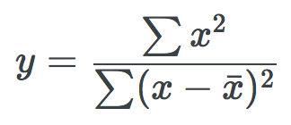

# Keystroke Countdown

This is the source for a static site generator that generates my personal blog,
[keystrokecountdown.com](http://keystrokecountdown.com). It uses [metalsmith.io](http://metalsmith.io) as its
engine. The site generates HTML files from Markdown text files and IPython notebook files. For rendering, I use:

* [Remarkable](https://github.com/jonschlinkert/remarkable) for Markdown processing
* [notebookjs](https://github.com/jsvine/notebookjs) for IPython processing
* [KaTex](https://github.com/Khan/KaTeX) for math typesetting (faster than MathJax)

The inclusion of KaTex allows me to embed math equations in a Markdown post. This can be done in two ways, as a
separate block or inline in Markdown text. First, separate block:

```
$$
y = \frac{\sum x^2}{\sum (x - \bar x)^2}
$$
```
Next, inline math: \\\\(E = mc^2\\\\). The above should render something like:



The line with the inline math should look something like this:


## Thanks

I heavily borrowed from what others were doing in this area. In particular, I learned much from two blogs with
Github repos:

* [blakeembrey.com](http://blakeembrey.com)
* [mrkiffie.com](http://mrkiffie.com)

Feel free to fork this repo and reuse what you want for your own blog.

# New Posts

In my blog, all posts are under the `src/articles` directory. I first create a new directory to host the
posting, then I create a new `index.md` within the new directory. If necessary, I add image files to the
directory and then reference them without any path info in the Markdown text. For example:

```
This is my new car: 
```

In the `index.md` file (can be named something else BTW), I populate the preamble that contains the metadata
that describes the new post. Here is the preamble for one of my posts:

```
--- 
title: Power of Optimal Algorithm Design
description: A brief look at how a simple choice in algorithm implementation can greatly affect performance.
date: 2016-05-01 12:18:02 UTC+02:00
author: Brad Howes
tags: Algorithms
layout: post.hbs
image: power.png
---
```

# Generating Site

To generate static pages from what is found in `src`, do

```sh
node build
```

After generating the pages, this will start up a simple web server at `localhost:7000` at which you can connect
via a browser to view the blog site.

# Data Model

When the `metalsmith.io` processing engine runs, it propagates a `data` object for each Markdown (`*.md`) or
IPython notebook (`*.ipynb`) file it finds under `./src`. The `data` object contains metadata accrued during the
various processing steps. One of the last processing steps involves converting
[Handlebar](https://github.com/wycats/handlebars.js/) templates into HTML files. For my site, I rely on three
templates:

* `./templates/about.hbs` -- generates a web page that talks about me
* `./templates/archive.hbs` -- generates a web page that shows a chronological list of articles starting with the
  most recent
* `./templates/post.hbs` -- generates an article from a Markdown file or IPython notebook

All of these templates take information from the `data` metadata object that corresponds to the Markdown or
IPython source file. They also use information found in the `site` object that contains metadata associated with
the blog site itself. Here are the specific items that are referenced:

From the `site` definition:

| Name | Definition |
| ---- | ---------- |
| `site.url` | URL for the site (`http://keystroke.com`) |
| `site.title` | The title of the site (Keystroke Countdown) |
| `site.description` | Short description of the blog site |
| `site.author.name` | My name (Brad Howes) |
| `site.author.bio` | Short description of myself |
| `site.author.image` | An image file for the author, shown in a circle at the bottom of the page |
| `site.author.location` | Where I am currently located (Prague, Czech Republic) |
| `site.author.website` | I use this to show my LinkedIn link |

From the source document's metadata:

| Name | Definition |
| ---- | ---------- |
| `title` | The `title` metadata from the preamble of the soure file. Sets both the browser window **and** the first heading of the page |
| `date` | When the article was written |
| `image` | Optional relative URL pointing to a JPEG or PNG file to use as the banner for the page |
| `robots` | `true` or `false` depending on if the HTML file is suitable for scanning by search engines |
| `description` | Used to set the `<meta name "description">` HTML tag in the generated HTML file |
| `tags` | Comma-separated list of tags associated with the article |
| `contents` | The body of the article or IPython notebook |
| `relativeURL` | The partial URL of the page (minus the `hostname:port`). Always starts with a `/` character |
| `absoluteURL` | Concatenation of the `site.url` and the `relativeURL` |
| `snippet` | Optional text that contains the first 280 or so characters from the source material |
| `formattedDate` | Formatted representation of the `date` value (in MONTH DAY, YEAR format) |

The `collections` plugin generates an ordered list of postings and updates their `data` objects with `previous`
and `next` links to each other. The plugin also creates a `collections.articles` object which the
`./templates/archive.hbs` uses to show the chronological list of articles and their links.

Most of the above have defaults that will be used, or alternatively the generated HTML will account for a
missing value.

## Partials

There is some duplication among the Handlebar templates, but most of the common HTML material is found in the
`./templates/partials` directory. These are snippets of template code that can be shared amoung the template
files. To use them, one uses the Handlebar include construct:

```
{{>foo}}
```

where `foo` is the name of the partial to insert.

There are currently seven partials:

| Name | Definition |
| ---- | ---------- |
| `author.hbs` | Shows information about the author (me) as well as links for sharing of the post on social media sites |
| `footer.hbs` | Shows copyright info at the bottom of the page |
| `header.hbs` | Shows banner image and navigation menu |
| `html-head.hbs` | Defines the page's metadata (`meta` tags) and CSS stylesheets to use |
| `navigation.hbs` | Defines the contents of the navigation menu shown on the right of the page |
| `scripts.hbs` | Contains the Javascript files to load after the HTML body contents |
| `title.hbs` | Generates the first heading of the page that contains the article's title |

## Helpers

Nearly all of the data necessary for HTML generation is available from the above `data` or `site` sources.
However, there are a few cases where one must dynamically determine content. I only need the services of three
Handlebar helpers -- functions that Handle bar will invoke when requested to assist in generating HTML output.

| Name | Definition |
| ---- | ---------- |
| `encode` | Run `encodeURIComponent` on a given URL fragment |
| `date` | Format a date value, either one that is given or the current time when generating HTML |
| `asset` | Generate a relative URL for a given CSS or Javascript file |

# Examples

## Home/Archive Page (/index.html)

Shows a list of articles in reverse chronological order.


## About Me Page (/about/index.html)

Vanity page.


# License

MIT
