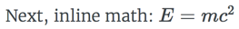
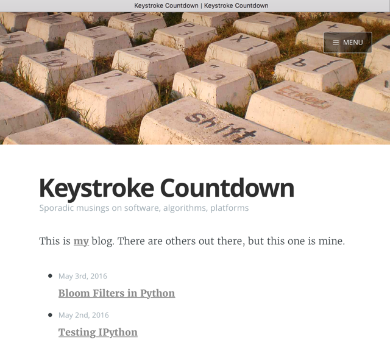
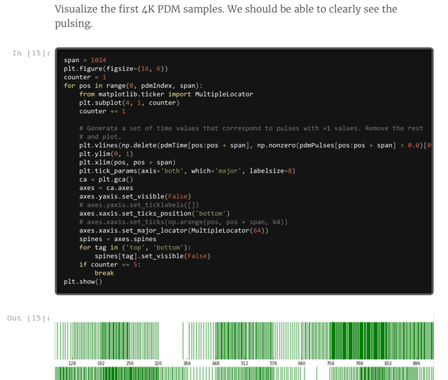

# Keystroke Countdown

This is the source for a static site generator that generates my personal blog,
[keystrokecountdown.com](http://keystrokecountdown.com). It uses [metalsmith.io](http://metalsmith.io) as its
engine. The site generates HTML files from Markdown text files and IPython notebook files. For rendering, I use:

* [Remarkable](https://github.com/jonschlinkert/remarkable) for Markdown processing
* [notebookjs](https://github.com/jsvine/notebookjs) for IPython processing
* [KaTex](https://github.com/Khan/KaTeX) for math typesetting (faster than MathJax)

The inclusion of KaTex allows me to embed math equations in a Markdown post. This can be done in two ways, as a
separate block or inline in Markdown text. First, separate block:

```
$$
y = \frac{\sum x^2}{\sum (x - \bar x)^2}
$$
```
Next, inline math: \\\\(E = mc^2\\\\). The above should render something like:


The line with the inline math should look something like this:



Sorry for the images, but Github's own [markup](https://github.com/github/markup/issues/274) code base does not
support math typesetting at this time.

## Thanks

I heavily borrowed from what others were doing in this area. In particular, I learned much from two blogs with
Github repos:

* [blakeembrey.com](http://blakeembrey.com)
* [mrkiffie.com](http://mrkiffie.com)

And though at times I had to jump into code in `./node_modules` to see what was going on, a big thanks to
the developers of [metalsmith.io](http://metalsmith.io) and the developers of the various Metalsmith plugins I
use.

Feel free to fork this repo and reuse what you want for your own blog.

# Installation

The blog building script (`build`) is in Javascript so it requires [Node](https://nodejs.org) to run. It should
work with the latest version, but I'm currently using v9.5.0 on macOS High Sierra (10.13.3). The only other
dependdency is on the [ImageMagick](http://formulae.brew.sh/formula/imagemagick@6) image manipulation software
since the blog building script depends on the
[imagemagick-native](https://www.npmjs.com/package/imagemagick-native) NPM package for scaling images embedded
in the posts. For now, I must use v6 of ImageMagick as the NPM package does not support v7.

# New Posts

In my blog, all posts are under the `src/articles` directory. I first create a new directory to host the
posting, then I create a new `index.md` within the new directory (can be named anything ending with an `md`
extension ). If necessary, I add image files to the directory and then reference them without any path info in
the Markdown text. For example:

```
This is my new car: 
```

In the `index.md` file, I populate the preamble that contains the metadata that describes the new post. Here is
the preamble for one of my posts:

```
---
title: Power of Optimal Algorithm Design
description: A brief look at how a simple choice in algorithm implementation can greatly affect performance.
date: 2016-05-01 12:18:02+01:00
author: Brad Howes
tags: Algorithms
layout: post.hbs
image: power.png
---
```

# Generating Site

To generate static pages from what is found in `src`, do

```sh
node build
```

After generating the pages, this will start up a simple web server at `localhost:7000` at which you can connect
via a browser to view the blog site. To just build without the server, use `-n` option. Also, there is a
*production* build mode which is subtly different than the normal *development* build. This happens with the
addition of the `-p` option.

## Rebuilding on File Change

There is an existing plugin -- [metalsmith-watch](https://www.npmjs.com/package/metalsmith-watch) -- which will
instantiate a rebuild of generated artifacts when source elements change. Unfortunately, it does this in the
same context as the initial build. As a result, one must be careful with plugins and one's own processing and
discard any previous state. I was encountering problems with this -- specifically, the conversion from IPython
to HTML was creating clones during each rebuild -- so I opted for a much simpler approach: rebuild everything in
a new context. To do so, I simply refactored `build.js` to contain everything inside a `run` function. Next, I
used a [gazer](https://www.npmjs.com/package/gazer) to watch for changes in a set of paths. When `gazer`
detected a change in one or more files, the code stages a new call to the `run` function.

```javascript
.use(ifFirstTime(function(files, metalsmith, done) {

    // Watch for changes in the source files.
    //
    var paths = [
        "src/**/*.+(ipynb|md)", // HTML source files
        "src/css/**/*",         // CSS and font files
        "src/js/**/*",          // Javascript files
        "templates/**/*"        // Handlebar templates and partials
    ];

    if (typeof metalsmith["__gazer"] == "undefined") {

        // Need to create a new file watcher
        //
        var pendingUpdate = false;
        var updateDelay = 100; // msecs

        console.log("-- watcher: starting");
        metalsmith.__gazer = new Gaze(paths);
        metalsmith.__gazer.on("all", function(event, path) {
            console.log("-- watcher:", path, event);
            if (pendingUpdate) {
                clearTimeout(pendingUpdate);
            }
            pendingUpdate = setTimeout(function() {
                console.log("-- watcher: rebuilding");
                run(false);
                console.log("-- watcher: done");
            }, updateDelay);
        });
    }

    return done();
}))
```

This works fine, but it is of course expensive to do when there are many files to rebuild. However, the watching
is only useful to me for development of the site, and a subset of sources could always be had if rebuild times
were becoming too large.

# Data Model

When the `metalsmith.io` processing engine runs, it propagates a `data` object for each Markdown (`*.md`) or
IPython notebook (`*.ipynb`) file it finds under `./src`. The `data` object contains metadata accrued during the
various processing steps. One of the last processing steps involves converting
[Handlebars](https://github.com/wycats/handlebars.js/) templates into HTML files.

All of these templates take information from the `data` metadata object that corresponds to the Markdown or
IPython source file. They also use information found in the `site` object that contains metadata associated with
the blog site itself. Here are the specific items that are referenced:

From the `site` definition:

| Name | Definition |
| ---- | ---------- |
| `site.url` | URL for the site (`http://keystroke.com`) |
| `site.title` | The title of the site (Keystroke Countdown) |
| `site.description` | Short description of the blog site |
| `site.author.name` | My name (Brad Howes) |
| `site.author.bio` | Short description of myself |
| `site.author.image` | An image file for the author, shown in a circle at the bottom of the page |
| `site.author.location` | Where I am currently located (Prague, Czech Republic) |
| `site.author.website` | I use this to show my LinkedIn link |

From the source document's metadata:

| Name | Definition |
| ---- | ---------- |
| `title` | The `title` metadata from the preamble of the soure file. Sets both the browser window **and** the first heading of the page |
| `date` | When the article was written |
| `formattedDate` | Formatted representation of the `date` value (in MONTH DAY, YEAR format) |
| `image` | Optional relative URL pointing to a JPEG or PNG file to use as the banner for the page |
| `layout` | Handlebars template to use for rendering |
| `description` | Used to set the `<meta name "description">` HTML tag in the generated HTML file |
| `tags` | Comma-separated list of tags associated with the article |
| `contents` | The body of the article or IPython notebook |
| `relativeURL` | The partial URL of the page (minus the `hostname:port`). Always starts with a `/` character |
| `absoluteURL` | Concatenation of the `site.url` and the `relativeURL` |
| `url` | Same as `relativeURL`. This is used by the RSS feed generator |
| `snippet` | Optional text that contains the first 280 or so characters from the source material |

Most of the above have defaults that will be used, or alternatively the generated HTML will account for a
missing value.

## Collections

The [metalsmith-collections](https://www.npmjs.com/package/metalsmith-collections) plugin generates an ordered
list of postings (sorted by date), and updates article `data` objects with `previous` and `next` links to each
other. The plugin also creates a `collections.articles` object which the `./templates/archive.hbs` uses to show
the reverse chronological list of articles and their links.

## Tags

The [metalsmith-tags](https://www.npmjs.com/package/metalsmith-tags) plugin scans the set of articles for `tag`
metadata and generates a mapping of tag values to articles. For each tag, it also creates a new build object
with a URL specific for the tag (e.g. `topics/foobar.html` for the tag `foobar`).

Presumably, this second group of build objects matching the pattern `topics/*.html` could be collected using the
`metalsmith-collections` object, but I opted instead to do this step myself with the following snippet taken
from the `build.js` file:

```javascript
.use(function(files, metalsmith, done) {

    // Generate an array of tag objects alphabetically ordered in case-insensitive manner. Also, add to
    // each tag object an `articleCount` with the number of articles containing the tag, and a `tag`
    // attribute containing the tag value.
    //
    var sortedTags = [];
    var tags = metalsmith.metadata()["tags"];
    Object.keys(tags).forEach(function(tag) {
        var count = tags[tag].length;
        tags[tag].articleCount = count;
        tags[tag].tag = tag;
        sortedTags.push([tag.toLowerCase(), tags[tag]]);
    });

    // Sort the lower-case tags
    //
    sortedTags.sort(function(a, b) {return a[0].localeCompare(b[0]);});

    // Save the array of tag objects that are properly ordered
    //
    metalsmith.metadata()["sortedTags"] = sortedTags.map(function(a) {return a[1];});

    // Revise article metadata so that each tag is the tag object, and if there is no image, use
    // a default one from the home page.
    //
    Object.keys(files).forEach(function(file) {
        var data = files[file];
        if (! data["image"]) {
            data["image"] = "/computer-keyboard-stones-on-grass-background-header.jpg";
        }

        if (data["tags"] && data["tags"].length) {
            data["tags"] = data["tags"].map(function(a) {return tags[a];});
        }
    });

    return done();
})
```

# Templates

For the site, there are five distince page styles, each one with their own template:

* `./templates/about.hbs` -- generates a web page that talks about me
* `./templates/archive.hbs` -- generates a web page that shows a chronological list of articles starting with the
  most recent
* `./templates/post.hbs` -- generates an article from a Markdown file or IPython notebook
* `./templates/tag.hbs` -- shows a list of articles associated with one tag
* `./templates/tags.hbs` -- shows all of the tags found in the article metadata

## Partials

There is some duplication among the Handlebar templates, but most of the common HTML material is found in the
`./templates/partials` directory. These are snippets of template code that can be shared amoung the template
files. To use them, one uses the Handlebar include construct:

```
{{>foo}}
```

where `foo` is the name of the partial to insert.

There are currently seven partials:

| Name | Definition |
| ---- | ---------- |
| `author.hbs` | Shows information about the author (me) as well as links for sharing of the post on social media sites |
| `footer.hbs` | Shows copyright info at the bottom of the page |
| `header.hbs` | Shows banner image and navigation menu |
| `html-head.hbs` | Defines the page's metadata (`meta` tags) and CSS stylesheets to use |
| `navigation.hbs` | Defines the contents of the navigation menu shown on the right of the page |
| `scripts.hbs` | Contains the Javascript files to load after the HTML body contents |
| `title.hbs` | Generates the first heading of the page that contains the article's title |

## Helpers

Nearly all of the data necessary for HTML generation is available from the above `data` or `site` sources.
However, there are a few cases where one must dynamically determine content. I only need the services of three
Handlebar helpers -- functions that Handle bar will invoke when requested to assist in generating HTML output.

| Name | Definition |
| ---- | ---------- |
| `encode` | Run `encodeURIComponent` on a given URL fragment |
| `date` | Format a date value, either one that is given or the current time when generating HTML |
| `asset` | Generate a relative URL for a given CSS or Javascript file |

# Remarkable Customizations

The [Remarkable](https://github.com/jonschlinkert/remarkable)  processor for Markdown  is great utility,  but it
does have  some limitations. First, the  'fence' processing was  too limiting for  my taste -- in  particular, I
could not easily adapt  it to use [Prism](https://prismjs.com) for highlighting code or  console output. I could
get it to  run OK from within the  user's browser, but the whole point  of having a static site  was to minimize
amount of processing done by the browser.

Here is the snippet of code that initializes the Remarkable object that does the Markdown processing:

```javascript
const md = new Remarkable("full", markdownOptions)
  .use(katexPlugin)
  .use(require("./codeFence.js"))
  .use(require("./consoleFence.js"))
  .use(require("./graphFence.js"));
```

The three custom `use` injections are described below.

## Custom Static Prism Highlighting

Below is my adaptation of the `fence` function that resides in Remarkable. It simply enables highlighing of
fenced text before adding it to the rendered output. Since it usually involves code, I put it in the
`codeFence.js` file, but this is more of a misnomer since it applies to all fence blocks that are not handled by
another fence type handler (see below).

```javascript
const escapeHtml = require("./escapeHtml.js");

// Tweaked version of stock Remarkable code fence renderer that works with Prism as a highlighter.
//
module.exports = (md, options) => {
  md.renderer.rules.fence = (tokens, idx, options, env, instance) => {
    const token = tokens[idx];
    const langPrefix = options.langPrefix;

    let langName = '', fences, langClass = '';
    if (token.params) {

      // ```foo bar
      //
      // Try custom renderer "foo" first. That will simplify overwrite for diagrams, latex, and any other fenced
      // block with custom look
      //
      fences = token.params.split(/\s+/g);
      if (instance.rules.fence_custom.hasOwnProperty(fences[0])) {
        return instance.rules.fence_custom[fences[0]](tokens, idx, options, env, instance);
      }

      langName = fences.join(' ');
      langClass = ' class="' + langPrefix + langName + '"';
    }

    let highlighted;
    if (options.highlight) {
      highlighted = options.highlight.apply(options.highlight, [ token.content ].concat(fences))
        || escapeHtml(token.content);
    } else {
      highlighted = escapeHtml(token.content);
    }

    return '<pre' + langClass + '><code' + langClass + '>' + highlighted + '</code></pre>\n';
  };

  return md;
};
```

## Console Output

I have a need to show Unix commands and their output in my blog postings. Prism and friends have a nice way to
do this -- though not without some customization on my part: see [Formatting Console Output](console/index.html).

```javascript
const escapeHtml = require("./escapeHtml.js");

// Custom fence block render used when 'prompt' follows the beginning of the block -- ```prompt
//
// Emits the contents of the fence block wrapped in <pre> and <code> elements. The <pre> element has classes
// `command-line` and `language-console` in order to take advantage of the `command-line` plugin from Prism code
// colorizing library. Additional text after the `prompt` tag will appear in the <pre> tag as attributes,
// presumably ones that `command-line` understands.
//
module.exports = (md, options) => {
  md.renderer.rules.fence_custom.console = (tokens, idx, options, env, instance) => {
    const token = tokens[idx];
    const body = token.content.replace(/(^\s+|\s+$)/g,''); // strip leading/trailing whitespace
    let lines = body.split('\n');
    const bits = token.params.split(/\s+/g);
    let args = bits.length > 1 ? bits.slice(1) : [];
    if (args.length > 0) args = args[0].split(',');

    let demo = false;
    if (args.length > 0 && args[0] == "-d") {
      args = args.slice(1);
      demo = true;
    }

    const prompt = args.length > 0 ? args[0] : '%';
    const lang = 'language-' + (args.length > 1 ? args[1] : 'console');

    const promptOut = '<span data-prompt="' + prompt + '"></span>';
    let output = '<pre class="' + lang + '"><code class="' + lang + '"><span class="command-line-prompt">';

    for (let i = 0; i < lines.length; ++i) {
      const line = lines[i];
      if (demo) {
        if (args.length == 1 || i == 0) {
          output = output + promptOut;
        }
        else {
          output = output + '<span data-prompt=" "></span>';
        }
      }
      else if (line.slice(0, prompt.length) == prompt) {
        lines[i] = '<span class="command-line-command">' + escapeHtml(line.slice(prompt.length + 1)) +
          '</span>';
        output = output + promptOut;
      }
      else {
        lines[i] = escapeHtml(line);
        output = output + '<span data-prompt=" "></span>';
      }
    }

    return output + '</span>' + lines.join('\n') + '</code></pre>';
  };

  return md;
};
```

## Embedded SVG Graphics

Sometimes, I wish to draw something in a textual form that I can then render as a pretty picture. Editing the
text is fairly easy whereas editing a graphic is much more cumbersome to get into a format that is suitable for
the web. Enter the `viz.js` package (or hack per the author) which brings the power
[Graphviz](http://www.graphviz.org) to browsers and static site generators.

An older version worked just fine, but recent updates made it difficult to use with Remarkable due to how it
manages asynchronicity. However, I was able to get it working reasonably well by adding some Promise support to
Remarkable and my `build.js` script. I added a `addPromise` method to the Remarkable instance which records
promises of future rendering output. These are stored under `placeholder` token which is also injected into the
rendered HTML output.

```javascript const Viz = require('viz.js'); const { Module, render } =
require('viz.js/full.render.js');

// Custom fence processor for "```graph" blocks.
//
module.exports = (md, options) => {
  md.renderer.rules.fence_custom.graph = (tokens, idx, options, env, instance) => {
    const token = tokens[idx];
    const title = token.params.split(/\s+/g).slice(1).join(' ');
    const viz = new Viz({ Module, render });
    const promise = viz.renderString(token.content);
    const placeholder = instance.addPromise(token.content, promise);
    return '<figure class="graph">' + placeholder + '<figcaption>' + title + '</figcaption></figure>';
  };

  return md;
};
```

In the `processMarkdown` function of my `build.js` file, I process all promises with the following:

```javascript
// Generate HTML from the Markdown.
//
var contents = md.render(data.contents.toString());

// If the rendering left any promises, allow them to update the content with their resolved value.
//
for (let [placeholder, promise] of Object.entries(md.renderer.promises)) {
  promise.then(value => {
    contents = contents.replace(placeholder, value);
    return value;
  });
}

// Finally, when all promises are done, we update the metadata and signal Metalsmith to continue.
//
let allPromise = Promise.all(Object.values(md.renderer.promises));
allPromise.then(value => {
  data.contents = Buffer.from(contents);
  delete files[file];
  files[htmlPath] = data;
  done();
});
```

First, we replace each placeholder value with the actual value from the promise. Next, we wait for all promises
to be resolved, and then we update the Metalsmith records with the new HTML output. Finally, we signal Metalsmith
that we are done by calling the Metalsmith `done` sentinal function.

# Examples

## Home/Archive Page (/index.html)

Shows a list of articles in reverse chronological order.



## About Me Page (/about/index.html)

Vanity page.


## IPython Import

Example of HTML generated from an IPython notebook.



# License

MIT
