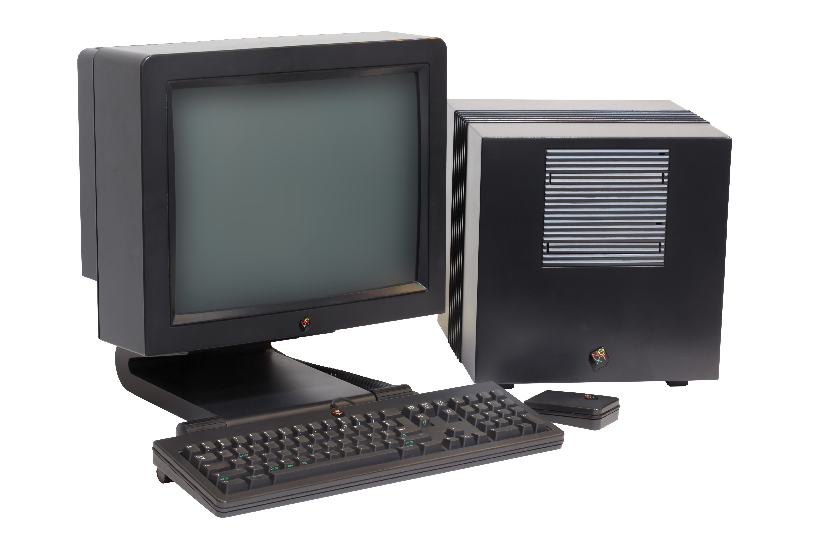

My name is Brad Howes. I program for a living and currently reside in Prague, Czech Republic. Some additional
details may be found below.

* [LinkedIn Profile](http://linkedin.com/in/bradhowes) -- best way to contact me if I don't know you
* [GitHub](http://github.com/bradhowes) -- not much there, but I do have a nifty Python interface for a SLiMP3
  display if you still have one ([Pyslimp3](https://github.com/bradhowes/pyslimp3)).

I'm a seasoned developer of large systems written in C++ and Python. I'm not too shabby with other languages
such as Javascript, Java, Emacs Lisp.

## Past Lives

This is how my time-line goes:

### ~1975 --- BASIC

I started programming in BASIC on massive desktop HP *calculators* at my dad's office at NASA. Something like
this:

What I remember best about that time was the *smell*: the metallic, sweet tang of electronics.

### ~1980 --- Z-80 Assembly

I got my first computer, a [Radio Shack Model III](https://en.wikipedia.org/wiki/TRS-80#modeliii). I had done
quite a bit of BASIC programming already on my dad's Model I, but now I was into Z-80 assembly. I obtained the
schematics for the computer, after which I built an external case with two slim height floppy drives
(may have been higher capacity, too -- I don't remember). I also swapped out the stock monitor with one that had
orange phosphor, and I added a switch to invert the video, putting black text on white background.
Although the inverted effect was cool at first, the video circuitry was taxed by the large amount of white on the
screen, which would cause a slight whine in the hardware.

### 1982 --- FORTRAN

While in high school, I was able to skip physical education and attend a numerical methods class at the
University of Houston. We were required to submit working FORTRAN code as solutions to various exercises.
Terminal access at the UofH computer center was incredibly tight during the day but the punch card terminals
were always available, so my first assignments were done by submitting batch jobs made up of punch cards.

Sometime later I discovered a Microsoft FORTRAN compiler for the Model III. That was a big step forward in
productivity since I could do my class assignments at home.

I also got my first programming gig: a customer at a computer store where I worked was looking to buy a computer
to do some wacky stuff involving lists of words and letter-number mappings -- perhaps numerology or
[gematria](https://en.wikipedia.org/wiki/Gematria). I offered to do the programming for her and submit printouts
of the results. The hardest part was typing in the word lists each week without errors.

Never did learn what she was hoping to discover.

### 1983-1984 --- IBM 360 Assembly

In 1983, I attended Rensselaer Polytechnic Institute in upstate New York. I was forced to take an introductory
Pascal course -- *sigh* -- but I also got to choose to attend a class on IBM 360 assembly. Way more fun, though
editing assembler code on the unergonomic [MTS](https://en.wikipedia.org/wiki/Michigan_Terminal_System)
terminals in the computer center was a PITA. My one and only time to ever use
[EBCDIC](http://www.astrodigital.org/digital/ebcdic.html) while programming.

### 1987 --- First Job

My first job after graduating (from Sarah Lawrence College, not RPI), was at a small firm in New Jersey called
Precision Nesting Systems. Originally, I started as a technical writer but I soon moved to doing some FORTRAN
and C coding. When I left in ~1990, I was traveling the US and Europe to install systems, train users,
troubleshoot problems, and write custom code to interface with various peripherals and CNC machines.

### 1990 --- First Startup

I became a contractor in 1990 and my first assignment was at a startup callled BioAutomation, one of many that
hoped to tap into the funding from the
[Human Genome Project](https://en.wikipedia.org/wiki/Human_Genome_Project). I was doing image analysis to
automate the detection of amino acid bands in electrophoresis trays, something like this:

Unfortunately, the founder had worked at a large company doing similar work, so we were sued into bankruptcy. It
was fun while it lasted.

### 1990 --- The Corporate Years

I moved to Phoenix, Arizona to join a team IBM assembled to create a new, modern customer service application
for American Express. The project was called "CS-90's" and working on it was a major blast of late night hacking
on IBM AIX RS6000 machines in C, X11, and Motif. We also had massive blowouts on Friday evenings at a restaurant
down the street from the office, usually resulting in Motorola pagers submerged in daiquiris or margaritas. And
maybe a brawl...

### 1994 --- Motorola and Python

I was always a fan of Apple products. I knew that they used Motorola processors so I was excited to join
Motorola's Scottsdale facility. I joined Corporate Computer Services (CCS) which was a sort of internal
contracting firm for other areas in Motorola that need a service or programming help. One service I inherited
was a email work-flow management system written in Objective-C that ran on a NeXT Cube.

My boss at the time was a big Perl developer, but I was never able to get over the shear ugliness of the code.
Instead, I began to work with Python when it was at version 1.5. I even wrote an
[article for Dr. Dobb's](http://www.drdobbs.com/web-development/template-processing-classes-for-python/184410485)
about a template processing library I created in Python.

I did not make the cover, but I'm there starting on page 38.

### 1999 --- Return to the East Coast

I saw a posting on the `comp.lang.python` for a job opportunity at
[Dragon Systems](https://en.wikipedia.org/wiki/Dragon_NaturallySpeaking) in Waltham, Massachusetts. I was
tired of the perpetual summer of Arizona and I missed the vibe of the east coast, so I applied, got the job, and
moved back east. Loved the company and the co-workers, but sadly everything imploded soon after Dragon was
purchased by their chief competitor, Lernout & Hauspie, due to a massive L&H accounting scandal in South Korea.
Fortunately for me, I cashed out the little stock I had before things got bad, but the Dragon founders were not
so lucky.

I jumped to another startup in Cambridge called ProfitLogic that was attempting to optimize pricing strategies
of seasonal apparel -- how much to markdown an item and when -- to maximize revenue and minimize inventory. The
code was a horrible mess of C++ and Python. However, I did get my first introduction to an *agile* methodology
known as [extreme programming](https://en.wikipedia.org/wiki/Extreme_programming). Lots of interesting concepts,
but the pair-programming took some time to get used to, especially when the partner's keyboard was in a
different layout or filled with crumbs and beard hair.

### 2001-2010 --- The Golden Years

I took leave from ProfitLogic to spend time sailing on the Charles river, in Boston harbor, and in the
Carribean. When I was ready to work again, I landed a great job at
[MIT's Lincoln Laboratory](http://www.ll.mit.edu) as a member of their technical staff. This is/was such an
incredible place to work: the people, the facilities, the assignments. All were great. I was working in C++,
Python, Qt, and Matlab for surveillance-related projects. I travelled quite a bit to the DFW airport for one
project, and an undisclosed place in Nevada for another. At the former, I got to stay at a Marriott hotel; at
the latter I basically got a dorm room with a too-soft bed.

I would have stayed at MIT/LL, but my wife and I were looking for opportunities to live in Europe with our three
children. And in 2010, Skype called.

### 2010-2016 --- The Right Side of the Atlantic

I joined Skype's Prague office before Skype was acquired by Microsoft. I started out as a C++ programmer on
their backend system involved in connecting Skype calls with landline phones. This service allowed Skype users
to dial most landline/mobile phone numbers. The other direction -- from landline to Skype -- is a service
whereby a Skype user can purchase the use of a landline phone number in a country, and calls to that number will
call into to a Skype application running on a desktop or a mobile device. Very cool service. My wife still has a
Skype number in Pennsylvania so that her mother can reach her in Prague by dialing a local number.

When Windows 8 was a year away from launch, we started a new team to support its push notifications. I and
others developed a simple service to generate push notifications for Windows 8 desktop. We soon added support
for Google's Android and Apple's iOS, and later on for Amazon's Kindle and a few other esoteric systems. Soon
after getting the C++ system up and running on Skype's Debian servers, we transformed into a team of C#
developers and we began to focus on retooling the service to run on Microsoft's Azure platform.

With that change, I moved over from engineering to product managment for a change of pace. I was traveling to
London quite a bit since most of the other PMs were located in the Skype London office. I was also flying to the
west coast about 3 times a year. And I was still trying to do some programming when I could. I developed a
performance dashboard for the team in Flask/Python, jQuery/Javascript, and
[Highcharts](http://www.highcharts.com) using performance data from our Azure micro services.

The really cool thing about the dashboard is that it appeared as a screen saver on the Windows machine that
the team used for Skype calls, so it was always visible when the computer was not being used. The screen saver
would cycle through the various graphs, one per minute.

I also wrote a log query tool that leveraged Python's *multiprocessing* module to perform queries in a
*map-reduce* form -- a farm of parallel tasks would independently search log blobs, and a *reduce* step would
collate the results for presentation to the user. I talk about some of this in various blog postings on this
site.
