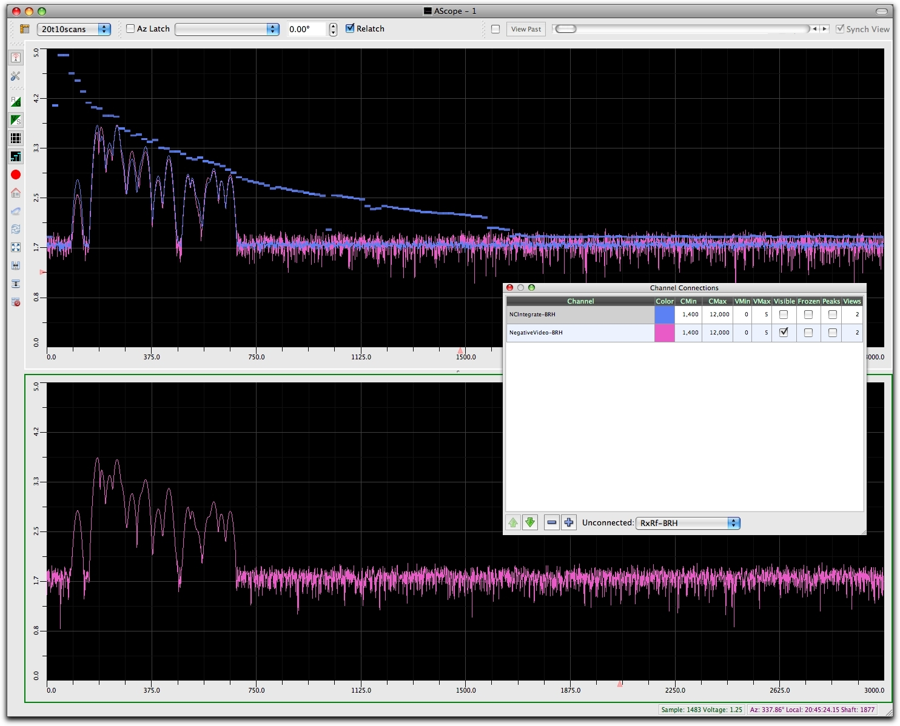

--- 
title: A-Scope Signal Display
description: A multi-channel signal display I wrote in Qt
date: 2009-10-12 12:18:02+01:00
author: Brad Howes
tags: Qt, Radar
template: post.hbs
layout: post.hbs
image: zibiz0q055hitq.jpg
---

An A-scope is a plot of individual radar returns, where the X axis represents time or distance, and the Y axis
is intensity or sample count. I wrote this using [Qt](http://www.qt.io) library (no OpenGL needed here). This
application supports multiple input channels (we were showing 20 or so simultaneously), multiple windows, and
multiple splitting of views, with each view showing its own set of channels.

The application also supported a buffered mode which would allow the user to scroll back N seconds to see the
signal in the past. This worked fine, but in the end the users did not really use it that much. Instead, they
would rely on an azimuth trigger that would capture some frames between two azimuth values and look at that.
