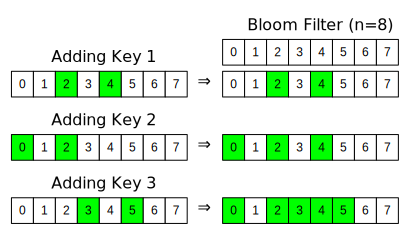
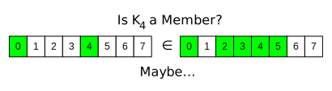

--- 
title: Bloom Filters in Python
description: Bloom Filter can quickly and accurately determine if a given key is not part of a set of keys. 
date: 2016-05-03 12:18:02+01:00
author: Brad Howes
tags: Python, Algorithms
layout: post.hbs
image: BloomFilters.svg
---

A Bloom filter provides fast determination if a key is **not** in a set. It consists of a collection of N bits.
Adding a key to the filter requires generating one more more bits (hashing) to represent the key, and those bits
are then OR'ed together with existing bit values in the collection. Thus, the filter represents the aggregate
bit mask of all of the keys added to it.

Below is a depiction of a Bloom filter as three keys are added to it. Note that once a bit in the filter is set
(green), it stays that way forever.



To check if a key `K` is in the filter, one just hashes the key to get the bit pattern and then checks of all of
the bits are present in the filter. Since the combining operation is an OR, if a bit is not found in the
collection, then the key was never added. However, the addition of two or more different keys could set the bits
of key `K`, thus making it appear that `K` was added to the collection some time in the past. That is why the
filter only guarantees being able to filter out unseen keys; false positives may happen due to bit patterns
overlapping with other keys.



Here, we ask if a key that was not added to the filter is a member. Since the two 1 bits of the key are also set
in the filter bit array, the filter can only say *perhaps*.

Even though the filter can not conclusively say a key is part of the collection, the Bloom filter is still very
useful as a way to reduce the amount of work a system must perform when given a random set of keys. Take for
instance a search engine that can preprocess the searchable material and generate bit patterns of all the
material. The work performed by the search engine is now reduced by some amount due to the ability to
definitively state that some queries will not return a value.

For a past project, my team used a Bloom filter to be able to quickly determine if there was any value in
downloading an encrypted and compressed log file for search processing. Since downloading, decrypting, and
uncompressing a log file are all expensive operations, anything that we could do to reduce their occurrence
would be a big win.

The keys of the Bloom filter were SHA hashes of user IDs, and the hashing of each key resulted in 2 bits of
information (out of a table size of N bits). As the cloud service generated log entries it also added the user
ID hash to a bloom filter. When the service closed, compressed, encrypted, and saved the log on Azure, it also
saved the bit array of the Bloom filter as metadata of the log blob.

## Python BloomFilter

Below is the `BloomFilter` class I wrote for our log query operation. It takes in a list of byte values which
will be used as the source for a [bitarray](https://pypi.python.org/pypi/bitarray/0.8.1) object (little-endian).
It also accepts a count of the number of hashes (bits) a key has.

```python
from bitarray import bitarray
import Logger

class BloomFilter(object):
    '''Implementation of a read-only Bloom filter. Takes binary values from an Azure table entity.
    '''
    def __init__(self, rawBytes, hashCount):
        '''Initialize our bitarray that returns true/false for indices from hash values
        
        rawBytes -- binary values from Azure entity that represents the Bloom Filter recording
        hashCount -- value from Azure entity that defines how many bits a key has
        '''
        gLog.begin(len(rawBytes), hashCount)

        # Initialize bit array from raw bytes
        self.bits = bitarray(endian = 'little')
        self.bits.frombytes(rawBytes)

        self.size = self.bits.length()
        self.hashCount = hashCount
        gLog.end()

    def contains(self, hashInit):
        '''Determine if a given user ID hash pair is found in the filter. Implementation follows that of the C# 
        code in the cloud service.

        hashInit -- the starting hash pair

        Returns True if the object represented by the hashInit is most likely in the filter (there can be false
        positives)
        '''
        gLog.begin(hashInit)

        # Convert to indices into the table
        h1, h2 = [h % self.size for h in hashInit]

        # Check N times with different hashes to see if the Skype ID is found. There are false positives, but no
        # false negatives.
        for index in range(self.hashCount):
            gLog.debug('h1:', h1, 'h2:', h2)
            if self.bits[h1] == False:
                gLog.end(False)
                return False
            # Generate a new, unique hash pair
            h1 = (h1 + h2) % self.size
            h2 = (h2 + index) % self.size
        gLog.end(True)
        return True
```

The `contains` method checks to see if the filter *might* contain a given value. The sole parameter is a 2-tuple
of integer values which represent a hash of the user ID. The routine then iterates the required number of times
to generate all of the bits for the key. However, if a bit does **not** exist in the filter's bit array, the
method stops and returns false.

Additional bits come from adding previous bit positions plus an incremental offset. If the original 2-tuple
values are randomly distributed for user IDs, then the resulting bits should be as well.

The above class does not offer a way to update the filter's bit array, but adding such a feature would be
trivial to implement using the code in the `contains` method.
