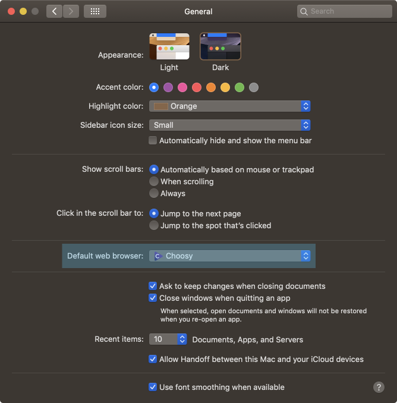
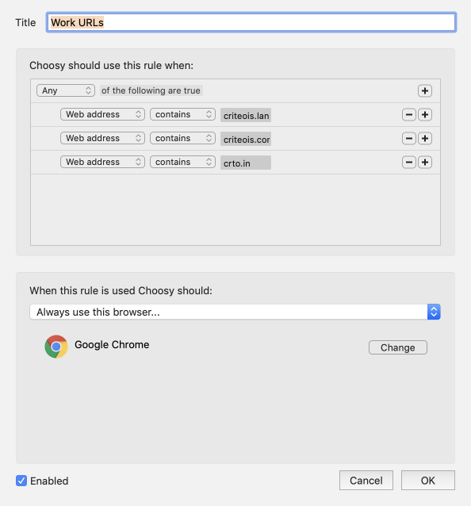
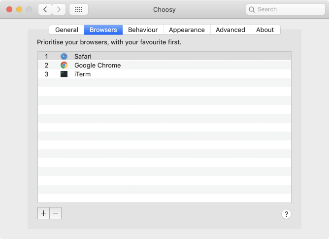

While at work at [Criteo](https://www.criteo.com/careers/), I use Chrome for various reasons that are not
important here. However, in general I prefer to use [Safari](https://www.apple.com/lae/safari/) because I am
used to it. This is not too much of a hassle except when I quickly click on a link and I find myself in the
wrong brower. I would then copy the URL, switch over to the right browser, and paste the URL to re-view the
page.

Since there are few domains that I need to view in Chrome, I thought perhaps I could write a [Keyboard
Maestro](https://www.keyboardmaestro.com) macro to eliminate the hassle above. Unfortunately, I was unable to
work out a clear and bullet-proof way to do so. However, in one of the user forums, somebody mentioned a small
utility that I had never heard before: [Choozy](https://www.choosyosx.com). This little gem lets one define
rules that govern which browser to use depending on various factors, including the URL domain. It is not free,
but one can try it out for 30 days. After about 10 minutes setting it up and visiting web links, I eagerly
bought a license for the princely sum of 10 USD.

## Configuration

The first step is to download Choosy and install it into the Applications folder. Next, we need to make it run
when we click on a URL. The macOS "General" panel in the "System Preferences" application has a setting called
_Default web browser_ with a pop-up menu showing the applications on the computer that can open URL links.
Select Choosy from the pop-up menu (highlighted in blue rectangle below).

Go back to the home preferences window and select Choosy at the bottom. There are five tabbed views that control
how Choosy operates with web links. Clicking on "Advanced" tab, shows custom rules that govern which browser to
use. I added one called "Work URLs" that have the following values:

These are three URL domains where I always want to use Chrome. I was pretty sloppy with the definitions, and I
might have been able to reduce the three rules to one using a regular expression, but they work just fine.

For the default case, Choosy relies on the ordering of apps in the second tab view. Here, I have Safari as the
first (default) browser, followed by Chrome and then a terminal program I frequently use.

You can configure Choosy to present a list of browser options when you click on a link, or to only use a running
browser. I have it configured to always use Safari as my favorite (default) browser unless one of the rules
applies, in which case Chrome will be used.
