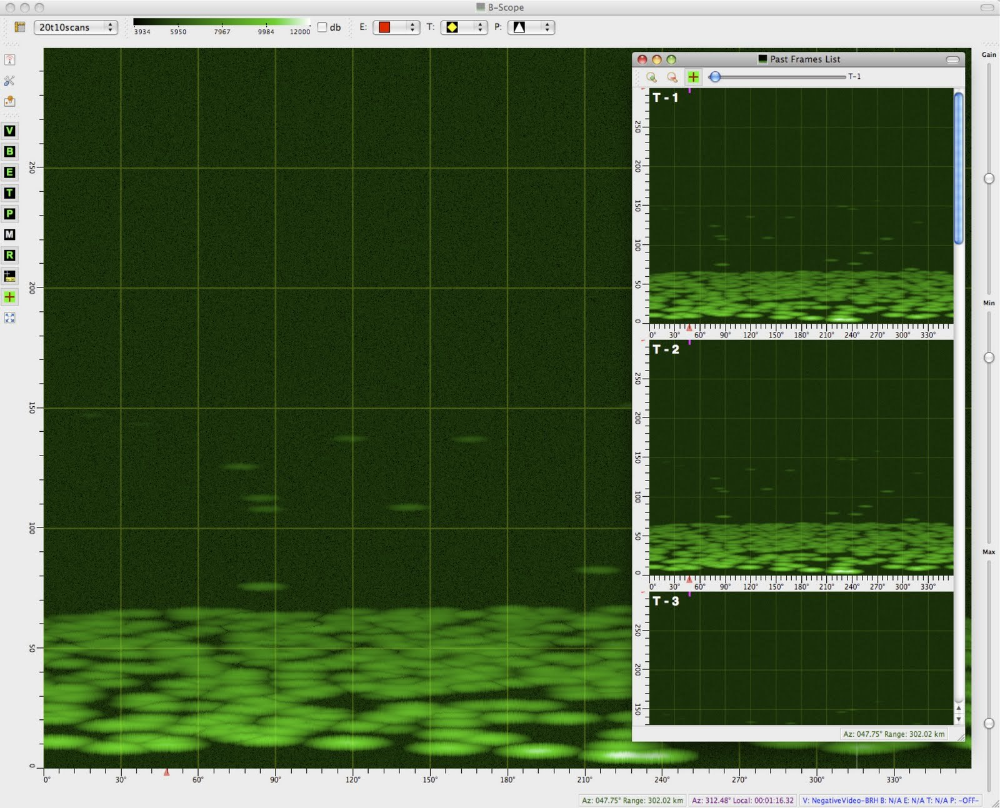

--- 
title: B-Scope Radar Display
description: A rectinlinear display of radar returns
date: 2009-10-13 12:18:02 UTC+02:00
author: Brad Howes
tags: Qt, OpenGL, radar
template: post.hbs
layout: post.hbs
image: 2karga0gtstkeq.jpg
---

Although most people have seen a radar display that is basically a polar plot in range and azimuth coordinates,
there is also a radar display that shows data in a cartesian coordinate space, with azimuth running along the X
axis (and overwriting as the sweep repeats azimuth values), and the range running along the Y axis. As for the
polar display I wrote about in a [previous post](/articles/radardisplay), I created this using
[Qt](http://www.qt.io) and OpenGL using pretty much the same compositing approach.

I add the ability to save snapshots of a scan just before the azimuth wraps to the left. Such snapshots appear
on the right side of the image above. There are actually two snapshot views, one showing all images as a list
and the other showing them as a movie. The rest of the functionality of the B-Scope is the same as the PPI.
