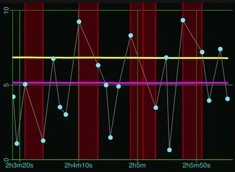

--- 
title: Working with Core Plot
description: Shows how to add and control Core Plot graphs
date: 2016-09-28 17:18:02+02:00
author: Brad Howes
tags: Swift, UI, CorePlot
layout: post.hbs
image: animation.gif
---

For fun, I've been rewriting an app I had created on iOS for measuring push notification performance. The
original was written in Objective-C (Obj-C), but the rewrite is in Swift. The application uses
[Core Plot](https://github.com/core-plot/core-plot) for visualizing, and much of my work so far has focused on
getting the plots to look and work right. Revisiting my code brought back memories of the difficulties I
encountered getting desired behavior out of the complex library (the generated documentation helps somewhat as
do the demo apps, but I often need to dive into Core Plot code to get the desired behavior)
this in another post).

Below is the main view of my app. The top graph shows the relative times when a notification
arrives at the device (X axis) and the amount of latency -- known or calculated -- between the sending of the
notification and its arrival.


There are actually *four* plots in the upper view:

* Scatter plot of latency values over time (light blue connected dots)
* Average latency value (plotted as yellow line)
* Median latency value (plotted as magenta line)
* Missing data (shown as shaded red regions)

I'll walk through how each of these is displayed.

## Graphing Environment Setup

The main element in the view is a `CPTXYGraph` instance. It defines much of the graphing environment, including
the axis and grid lines. For the most part, default settings will get you going, but I'm going to describe what
changes I made to get the effect I wanted.

First, the placement of the `CPTXYGraph` within the hosting view:

```swift
let graph = CPTXYGraph(frame: self.frame)
hostedGraph = graph

graph.backgroundColor = CPTColor.black().cgColor
graph.zPosition = 1_000

graph.paddingLeft = 0.0
graph.paddingRight = 0.0
graph.paddingTop = 0.0
graph.paddingBottom = 0.0

graph.plotAreaFrame?.masksToBorder = false;
graph.plotAreaFrame?.borderLineStyle = nil
graph.plotAreaFrame?.cornerRadius = 0.0
graph.plotAreaFrame?.paddingTop = 0.0
graph.plotAreaFrame?.paddingLeft = 22.0
graph.plotAreaFrame?.paddingBottom = 35.0
graph.plotAreaFrame?.paddingRight = 4.0
```

The `padding…` properties are offsets from the bounds of the hosting view. I've set them to zero (0.0) here in
order to use all available space. Next, there is the `plotAreaFrame` property, which defines the rectangle
around the plotting area. Note that this excludes the axis. Since I do not want the plotting area to overlap
with the X and Y axis areas, I set their padding to 35.0 and 22.0 respectively, values I came up with by trial
and error.

Next, we allocate a `CPTXYPlotSpace` and configure it. A plot space defines the transformation between plot
values and display units in both X and Y. One can have more than one plot space to support multiple transforms,
though in my graph I only use one.

```swift
let plotSpace = CPTXYPlotSpace()
graph.add(plotSpace)

plotSpace.allowsUserInteraction = true
PlotSpace.allowsMomentumX = true
plotSpace.xRange = CPTPlotRange(locationDecimal: 0.0, lengthDecimal: 100.0)
plotSpace.yRange = CPTPlotRange(locationDecimal: 0.0, lengthDecimal: 1.0)
```

The plot space also handles scrolling if enabled. This is done via the `allowsUserInteraction` property .

The `allowsMomentumX` property controls if scrolling momentum is in use. Momentum here means that scrolling will
continue for a configurable amount of time after a finger movement

As mentioned, the plot space defines the coordinate transforms for the width and height of the graph. In the
code above, I default them to some values which will at least show something even if there is no data to plot.

## Axis Configuration

There are a veritable *ton* of properties one can tweak for an axis. Most of them are self-explanatory, but a
few deserve some discussion.

```swift
x.labelOffset = -4.0
x.tickDirection = .negative
x.labelFormatter = BRHTimeFormatter()
```

By default, the tick labels for the X axis hang down quite a bit. I bring them closer to the axis by setting a
negative offset value for `labelOffset`. Next, I have the ticks pointing down from the axis line instead of up
by setting `tickDirection` to `.negative`. Finally, one can install a label generator. The class
`BRHTimeFormatter` converts X values into time labels like *3m35s*.

For the Y axis, much of the setup is similar, though there are a few options specific to its vertical nature.

```swift
y.labelRotation = CGFloat(M_PI_2)
y.axisConstraints = CPTConstraints(lowerOffset: 0.0)
```

I rotate the labels by 90° with `labelRotation` in order to minimize amount of margin I need for larger latency
values. I also set `axisConstraints` to constrain the Y axis so that it is always drawn at the left hand of the
plot, regardless of any scrolling in X. Remove this setting and one will have a Y axis that scrolls with the
plots.

There are some additional settings involving grid lines and tick marks, but these are not very interesting –
look at the code if curious.

Once the plot space is setup, we next create the four plots. The order in which they are added to the graph will
determine the order in which they are drawn – a plot added after another will draw over anything drawn by
previously-added plots.

## Missing Data Plot

The missing data plot shows where gaps are in the timeline where a value was expected but did not arrive. We
depict such gaps with a red rectangle, filled with a translucent red to reduce its intensity:

```swift
let plot = CPTScatterPlot()
plot.identifier = GraphLatencyByTime.kMissingPlotId
plot.dataSource = self
plot.cachePrecision = .double
let lineStyle = CPTMutableLineStyle()
lineStyle.lineJoin = .round
lineStyle.lineCap = .round
lineStyle.lineWidth = 1.0
lineStyle.lineColor = CPTColor.red()
plot.dataLineStyle = lineStyle
plot.areaBaseValue = 0.0
plot.areaFill = CPTFill(color: CPTColor.red().withAlphaComponent(0.25))
graph.add(plot, to: plotSpace)
```

Each plot has a unique identifier property. We will use these to select the right data for generating the plot,
and to allow the user to selectively show/hide the plot by tapping on the plot's legend entry. The rest of the
configuration is pretty normal. Again, we use a small alpha for the area fill so as to not overwhelm the graph
with the regions.

## Median and Average Latency Line Plots

The median plot shows the historical median latency value. It is configured as expected for a line plot.

```swift
let plot = CPTScatterPlot()
plot.identifier = GraphLatencyByTime.kMedianPlotId
plot.dataSource = self
plot.cachePrecision = .double
let lineStyle = CPTMutableLineStyle()
lineStyle.lineJoin = .round
lineStyle.lineCap = .round
lineStyle.lineWidth = 3.0
lineStyle.lineColor = CPTColor.magenta()
plot.dataLineStyle = lineStyle
graph.add(plot, to: plotSpace)
```

The average plot is the same except for the line color – yellow instead of magenta. The average value that is
plotted represents a running average over all of the received values, while the median value is the middle value
of a sliding window over the last N received values.

## Latency Scatter Plot

For the last plot, we want to show the sample values as light blue dots, with thin gray lines connecting them.

```swift
let plot = CPTScatterPlot()
plot.identifier = GraphLatencyByTime.kLatencyPlotId
plot.dataSource = self
plot.cachePrecision = .double
let lineStyle = CPTMutableLineStyle()
lineStyle.lineJoin = .round
lineStyle.lineCap = .round
lineStyle.lineWidth = 1.0
lineStyle.lineColor = CPTColor.gray()
plot.dataLineStyle = lineStyle
let symbolGradient = CPTGradient(beginning: CPTColor(componentRed: 0.75, green: 0.75, blue: 1.0, alpha: 1.0), ending: CPTColor.cyan())
symbolGradient.gradientType = .radial
symbolGradient.startAnchor = CGPoint(x: 0.25, y: 0.75)
let plotSymbol = CPTPlotSymbol.ellipse()
plotSymbol.fill = CPTFill(gradient: symbolGradient)
plotSymbol.lineStyle = nil;
plotSymbol.size = CGSize(width: kPlotSymbolSize, height: kPlotSymbolSize)
plot.plotSymbol = plotSymbol;
plot.plotSymbolMarginForHitDetection = CGFloat(kPlotSymbolSize) * CGFloat(1.5)
graph.add(plot, to: plotSpace)
```

As before we define the line style, but we also define a symbol to show. Here, we use a gradient to color the
circular symbol. We also set `plotSymbolMarginForHitDetection` with a larger size than the symbol size to make
touching the symbol easier. Touching the symbol shows the actual sample value.

## Graph Legend


Core Plot will draw a legend that shows plot indicators (color line and/or symbols) and a name. Note that the
order of the components in the legend are in the same order as how the plots were added to the graph. Here's the
setup code that configures the legend:

```swift
let legend = CPTLegend(graph: graph)
graph.legend = legend
graph.legendAnchor = .top
graph.legendDisplacement = CGPoint(x: 0.0, y: -5.0)
legend.isHidden = true
legend.fill = CPTFill(color: CPTColor.darkGray().withAlphaComponent(0.5))
let titleStyle = CPTMutableTextStyle()
titleStyle.color = CPTColor(genericGray: 0.75)
titleStyle.fontSize = 11.0
legend.textStyle = titleStyle;
let lineStyle = CPTMutableLineStyle()
lineStyle.lineWidth = 0.75
lineStyle.lineColor = CPTColor(genericGray: 0.45)
legend.borderLineStyle = lineStyle
legend.cornerRadius = 5.0
legend.swatchSize = CGSize(width: 25.0, height: 25.0)
legend.numberOfRows = 1
legend.delegate = self
let recognizer = UITapGestureRecognizer(target: self, action: #selector(handleTap))
recognizer.numberOfTouchesRequired = 1
recognizer.numberOfTapsRequired = 2
self.addGestureRecognizer(recognizer)
```

The legend will appear at the top of the graph, but it is initially hidden. A custom `UITabGestureRecognizer`
will toggle legend visibility when the user taps twice on the graph. Setting the legend's `delegate` property
will allow us to toggle visibility of individual plots when a legend component is tapped. Here are the methods
that control visibility, first for the legend as a whole, and then for individual plots:

```swift
func handleTap(recognizer: UITapGestureRecognizer) {
    guard let legend = self.hostedGraph?.legend else { return }
    legend.isHidden = !legend.isHidden
}
```

```swift
func legend(_ legend: CPTLegend, legendEntryFor plot: CPTPlot, wasSelectedAt idx: UInt) {
    plot.isHidden = !plot.isHidden
}
```

## Auto-Scaling in Y

When a new data sample arrives or when the user scrolls the graph in the X direction, I wanted the graph to
update the Y axis to always have the max value in the view as the max value of the Y axis (plus some padding).
To accomplish this, I first obtain the view values of the X axis in plot space units (seconds), and then query
the data source for the min/max sample values that fall between the two times.

```swift
fileprivate func updateYRange() {
    guard let plotSpace = hostedGraph?.allPlotSpaces().last as? CPTXYPlotSpace else { return }
    guard let axisSet = hostedGraph?.axisSet as? CPTXYAxisSet else { return }
    guard let x = axisSet.xAxis else { return }
    guard let y = axisSet.yAxis else { return }
    let xRange = plotSpace.xRange
    let yMinMax = findMinMaxInRange(range: xRange) ?? (0.0, 10.0)
    let yMax = floor(yMinMax.max + 0.9)
    if targetYMax != yMax {
        targetYMax = yMax
        let yRange = CPTMutablePlotRange(location: NSNumber(value: 0.0), length: NSNumber(value: yMax))
        y.majorTickLocations = Set<NSNumber>([0, yMax / 2, yMax].map { NSNumber(value: $0) })
        y.visibleAxisRange = yRange
        y.visibleRange = yRange
        x.gridLinesRange = yRange
        yRange.expand(byFactor: 1.05)
        let oldRange = plotSpace.yRange
        CPTAnimation.animate(plotSpace, property: "yRange", from: oldRange, to: yRange, duration: 0.25)
    }
    y.gridLinesRange = xRange
}
```

The `findMinMaxInRange` method will return the min/max Y values for the currently display X range. We then round
up the max value to the nearest whole value, and if it is not the same as the last max value, we update the
graph and Y axis so it will show the new Y range.

```swift
private func findFirstSampleAtOrBefore(when: TimeInterval) -> Int {
    let pos = source.samples.map({$0.arrivalTime}).insertionIndexOf(value: source.startTime.addingTimeInterval(when),
                                                                    predicate: {$0 < $1})
    return pos
}

private func findMinMaxInRange(range: CPTPlotRange) -> (min: Double, max: Double)? {
    if source.samples.count == 0 { return nil }
    let x0 = findFirstSampleAtOrBefore(when: range.locationDouble)
    let x1 = findFirstSampleAtOrBefore(when: range.endDouble)
    return source.samples[x0..<x1].map({$0.latency}).minMax()
}
```

The `findMinMaxInRange` functionality relies on two extensions to `Collection` types with `Comparable` elements.
First, is the method `insertionIndexOf(value:,predicate:)` which will return the index in a collection where
inserting a given value would keep the collection in an ordered state (see
[Adding Binary Search to Swift Collections](../swiftCollection/) for specifics). This is used by the
`findFirstSampleAtOrBefore(when:)` method. The second extension to `Collection` is a `minMax` method that
returns a 2-tuple containing both the min and max values within a collection or a slice of one.

To auto-scale during scrolling, I implemented the `plotSpace(space:,didChangePlotRangeFor:)` method of the
`CPTPlotpaceDelegate` protocol. Here, I discard any changes that make the X or Y axis min deviate from 0.0, and
when the X axis changes, I call `updateYRange()`.

```swift
extension GraphLatencyByTime: CPTPlotSpaceDelegate {
    func plotSpace(_ space: CPTPlotSpace, didChangePlotRangeFor coordinate: CPTCoordinate) {
        guard let plotSpace = space as? CPTXYPlotSpace else { return }
        switch coordinate {
        case .Y:
            let yRange = plotSpace.yRange
            if yRange.locationDouble != 0.0 {
                plotSpace.yRange = CPTPlotRange(location: NSNumber(value: 0.0), length: yRange.length)
            }
        case .X:
            let xRange = plotSpace.xRange
            if xRange.locationDouble < 0.0 {
                plotSpace.xRange = CPTPlotRange(location: NSNumber(value: 0.0), length: xRange.length)
            }
            updateYRange()
        default: break
        }
    }
}
```

## Auto-Scrolling X

If the user has not manually scrolled the graph to some point in the past, I want the graph to always show new
samples when they arrive. Arrival of new samples cause an iOS Notification event which the graph listens for. It
is processed in the `sampleAdded(notification:)` routine:

```swift
func sampleAdded(notification: Notification) {
    let info = RunDataNewSampleNotification(notification: notification)
    guard let plots = hostedGraph?.allPlots() else { return }
    plots.forEach {
        if $0.identifier === GraphLatencyByTime.kMissingPlotId {
            if info.sample.missingCount > 0 {
                let numRecords = info.sample.missingCount * 2 + 1
                $0.insertData(at: UInt(source.missing.count - numRecords), numberOfRecords: UInt(numRecords))
            }
        }
        else {
            $0.insertData(at: UInt(info.index), numberOfRecords: 1)
        }
    }
    if Thread.isMainThread {
        updateBounds()
    }
    else {
        DispatchQueue.main.async(execute: self.updateBounds)
    }
```

First, each plot's `insertData` method is called with the number of new records to add to the plot. the "missing
samples" plot adds 2N + 1 records for N missing samples, since the plot shows a very tall rectangle for each
missing sample. Next, I update the plot bounds (both X and Y) with a call to `updateBounds`. Since the
notification may arrive in a thread other than the main UI one, we make sure that `updateBounds` runs only on
the main UI thread.

The scrolling takes place in the following snippet from `updateBounds`:

```swift
else if plotData.count > 1 && xValueFor(sample:plotData[plotData.count - 2]) < plotSpace.xRange.endDouble {
    let oldRange = plotSpace.xRange
    let newRange = CPTMutablePlotRange(location: NSNumber(value: xMin), length: NSNumber(value: xMax - xMin))
    newRange.expand(byFactor: 1.05)
    CPTAnimation.animate(plotSpace, property: "xRange", from: oldRange, to: newRange, duration: 0.25)
}
```

Here we look to see if the the previous point is visible, and if so, we adjust the X range to show the new
point, animating the transition from the old X range to the new one.


