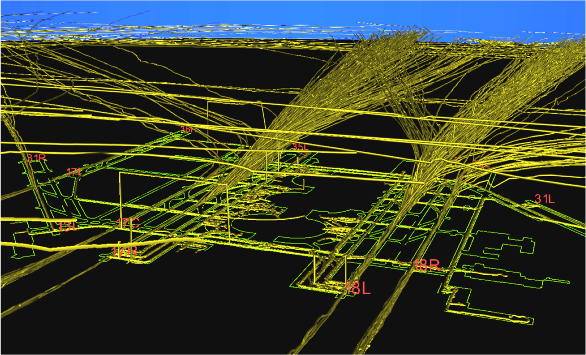

--- 
title: Visualizing Traffic at DFW Airport
description: An example of my early (and crude) visualization work at MIT/LL with surveillance systems data.
date: 2009-10-08 12:18:02 UTC+02:00
author: Brad Howes
tags: MITLL, DFW
image: uudfb3rmqexwq_retina.png
layout: post.hbs
---

Below is a snapshot of aircraft activity at the DFW airport over a period of several hours. It was rendered by
[Kitware's Visualization Toolkit (VTK)](http://www.kitware.com/opensource/vtk.html) on an Solaris workstation
using raw surveillance data from the aircraft transponders (ADS-B). The green lines on the surface represent the
airport, and the gold paths are tracks of aircraft and vehicles. The airport is in a south configuration, with
planes arriving from the north and departing to the south. Note the "goal post" at the left, where surveillance
reported a vehicle in the air for some amount of time when in fact it was clearly on the ground. The image was
captured while working on an FAA project called [Runway Status Lights](http://rwsl.ll.mit.edu/index.html).

