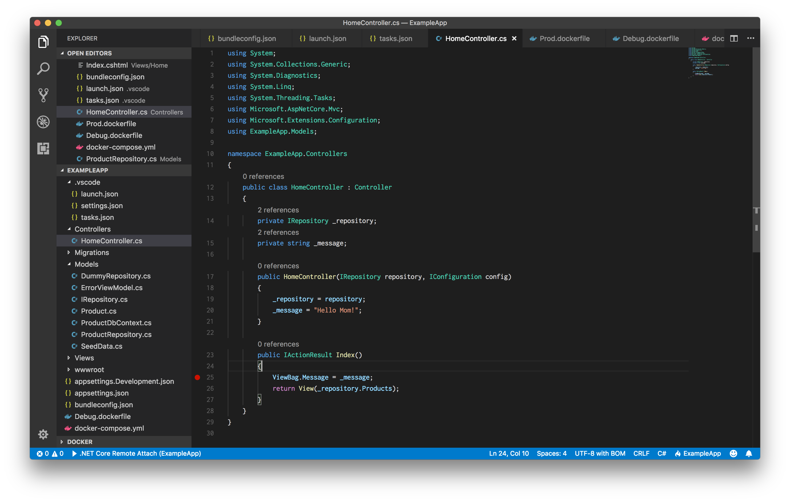
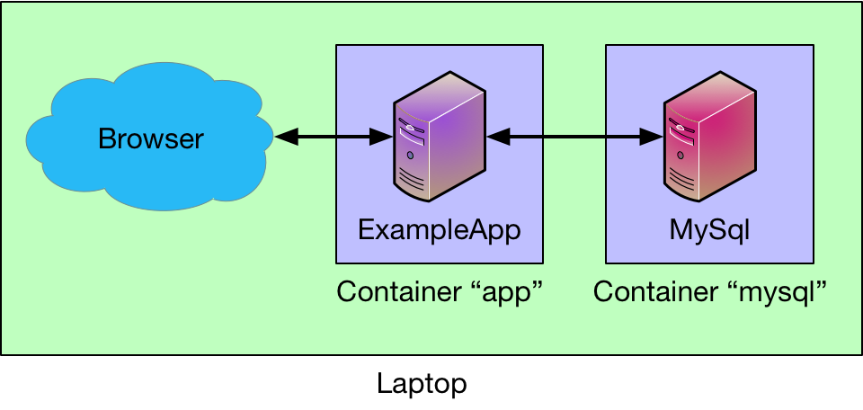
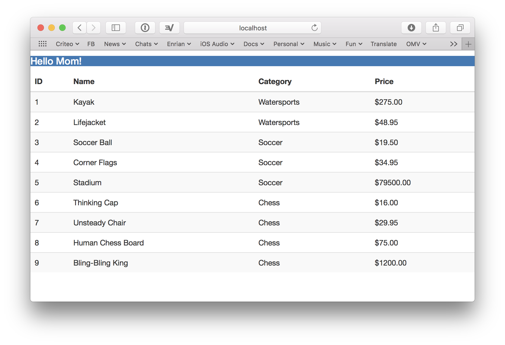

--- 
title: .Net Core Docker Apps
description: A brief look at using Docker containers to run a C# app
date: 2018-03-14 12:18:02+01:00
author: Brad Howes
tags: dotnet, C#, docker
template: post.hbs
layout: post.hbs
image: docker.png
---

Ages ago I checked out [Docker](https://docker.com) to see what all the excitement was about. It looked pretty
cool, but I did not really have a specific need for it. A couple of years ago, I encountered it again while I
was doing some development work involving a [Mattermost](https://mattermost.org) chat server -- the default
development environment depended on Docker containers. For a prototype service, I had a database in a Docker
container that was hosted in a Ubuntu VM running on Azure.

I now work for a company ([Criteo](https://criteo.com)) that is heavily invested in Microsoft's C#/.Net
ecosystem. There is also a fair amount of Java (and a much lesser amount of Python), but the heavy-duty apps are
mostly if not all in C#. With the steady progress of Microsoft's [.Net Core](https://www.microsoft.com/net/)
initiative, one can seriously consider hosting a C# .Net application on a platform other than Windows. And with
services such as Kubernetes, deploying and scaling an application in a container is fairly pretty trivial.
(Hat-dip to [Dave Hodson](https://twitter.com/davehod) for showing me the light, no matter however belatedly it
took to register)

As I am still a big fan of working on a macOS platform, I was curious to see how far I could go with the
following goals in mind:

* Develop a simple C# webapp on my Mac laptop
* Have the webapp communicate with [MySql](https://www.mysql.com) (also running on laptop)
* Have the webapp use [Redis](https://redis.io) as a key/value cache (*also* on laptop)
* Have all of the above running in separate Docker containers
* Attempt to debug the webapp in a container

As I show below, this is all easily doable today.

# Coding in Visual Studio Code

Without question, the most powerful code editor for C# is Microsoft's venerable
[Visual Studio IDE](https://www.visualstudio.com/vs/) on Windows OS. This is what I normally use at work. The
only downside is that it is huge and like much of Microsoft Office so full of functions and UI gadgets that one
can easily get lost. Now, Microsoft has variants of Visual Studio available for macOS, and -- woah! -- Linux. The
Linux one is very spartan, but sometimes spartan is good. The Linux one will also run fine on macOS, so I
decided to give that a spin on my laptop. Here is what it looks like:



Pretty neat! One of the really nice bits is that the cursor movement keystrokes I am used to from years of Emacs
coding work here as well. Nicer still, there is a form of Microsoft's acclaimed
[IntelliSense](https://msdn.microsoft.com/en-us/library/hcw1s69b.aspx) here which offers suggestions for
variables, class names, and such. And often when things go wrong, there are helpful hints for a useful solution
(not always -- I've solved more than one confounding error message with a trip to
[Stack Overflow](https://stackoverflow.com/company) -- but this is no different than macOS Xcode).

# .Net Core

To build an app in C#, one needs to install the
[.NET Core SDK](https://www.microsoft.com/net/download/macOS/build). This is easy to do and straightforward.
Alternatively, one can also develop a .NET app _inside a Docker container_. No need for that here, but it is a
pretty cool option.

Once installed, there is a `dotnet` program available at your local command-line:

```console
% dotnet --version
2.1.101
```

The VS Code UI application will use this when compiling and packaging .NET applications. However, _everything_
you can do in VS Code can also be done in a shell, though with a bit more typing.

# Docker on Mac

On Linux, Docker is little more than a set of command-line applications and libraries that leverage the
capabilities of the Linux kernel to provide very light-weight virtualization of applications in Docker
containers. On Windows and Mac, this is a bit more involved (more so on Windows), yet the result is the same: a
cross-platform environment for creating isolated application containers that can run anywhere where Docker is
installed (think Java's "write once, run anywhere" mantra but for real, and with less typing).

There are numerous references on the web about Docker and how to use it, so I will just denote the fundamentals
here:

* Docker _images_ define an environment where an app will run
* Docker _containers_ are instantiations of an image that can be started and stopped, and most importantly
_swarmed_
* Docker _volumes_ are virtual disks that can be managed just like files
* Docker _networks_ are virtual networks that can be configured at will without disturbing the host network

The setup I will describe below uses all of these concepts. The big win here, in my humble opinion, is that each
component does just what it needs to do (separation of concerns) while handling various use-cases such as

* App development and unit testing with container mocks (think RESTful interfaces)
* Integration testing using data found on test volumes
* Production app swarms using features found in Microsoft's Azure or Amazon's AWS

In short, using Docker allows one to compartmentalize various aspects of a production service such that one's
confidence will be high that what one does on a laptop/desktop while on an island will translate into an
application that is scalable and resilient without too much effort.

Now, the above is a rather bold statement so let's see if it proves out in practice.

# Test App

The setup I will demonstrate comes from the book
["Essential Docker for ASP.NET Core MVC"](https://www.amazon.com/Essential-Docker-ASP-NET-Core-MVC/dp/1484227778)
by Adam Freeman. It consists of two services, an ASP .NET application in C# that offers an HTTP service, and a
MySql database that provides data to be used by the first -- pretty simple stuff.



One aspect of this simple app that I have no experience with is the
[Entity Framework](https://msdn.microsoft.com/en-us/library/aa937723(v=vs.113).aspx) that does wonders for
managing schemas models declared in code. It performs much of the necessary magic when working with a database
without a bunch of headaches -- it just works (when it doesn't -- see migrations).

# Back to Docker

First, let's create our MySql container. We need a vao, let's create the volume to hold the MySql data:

```console
% docker volume create --name productdata
productdata
```

Next, we fetch a MySql Docker _image_ and use it to build a container we will use in the future:

```console
% docker pull mysql
Using default tag: latest
latest: Pulling from library/mysql
2a72cbf407d6: Pull complete
38680a9b47a8: Pull complete
4c732aa0eb1b: Pull complete
c5317a34eddd: Pull complete
f92be680366c: Pull complete
e8ecd8bec5ab: Pull complete
2a650284a6a8: Pull complete
5b5108d08c6d: Pull complete
beaff1261757: Pull complete
c1a55c6375b5: Pull complete
8181cde51c65: Pull complete
Digest: sha256:691c55aabb3c4e3b89b953dd2f022f7ea845e5443954767d321d5f5fa394e28c
Status: Downloaded newer image for mysql:latest
```

We download the latest MySql image because...

We should be able now to instantiate a new MySql app running in a container with:

```console
% docker run -d --name mysql --volume productdata:/var/lib/mysql -p 3306:3306 mysql
6859730ef4c29041f014359a525f26510c46bddb7caf5d11d740f73fe40d5b4d
```

And this would work -- we would have an isolated Docker container running the latest published image of MySql,
with port 3306 published and reachable by our laptop. However, we want to run with an abstracted network, so:

```console
% docker network create app
aaf5ef7ae7ec3be7c071cd4d8e17dcbde556b6e430cdbfbb88b4d38d00fa754e
```

Here we define a new virtual network called `app` with which we can do what we want with Docker managing state
among the participating containers;

```console
% docker stop $(docker ps -aq)
6859730ef4c2
% docker rm $(docker ps -aq)
6859730ef4c2
% docker run -d --network app --name mysql --volume productdata:/var/lib/mysql -p 3306:3306 mysql
91ec3f65f81db018747a74c4e9dd5006bd6d33e140008513469f8683e561ada3
```

Now, we have a self-contained MySql application that is only reachable by other entitites that know about the
`app` network.

# ExampleApp Container

The [code]() for the ExampleApp will compile and run, but on its own it will not find the database to connect to
since it is cannot _see_ the connections available in the `app` network. But, first to build:

```console
% dotnet build
Microsoft (R) Build Engine version 15.6.82.30579 for .NET Core
Copyright (C) Microsoft Corporation. All rights reserved.

  Restore completed in 63.06 ms for /Users/howes/src/dotnet/ExampleApp/ExampleApp.csproj.
  Restore completed in 85.27 ms for /Users/howes/src/dotnet/ExampleApp/ExampleApp.csproj.
  Restore completed in 45.38 ms for /Users/howes/src/dotnet/ExampleApp/ExampleApp.csproj.
  ExampleApp -> /Users/howes/src/dotnet/ExampleApp/bin/Debug/netcoreapp2.0/ExampleApp.dll

Build succeeded.
    0 Warning(s)
    0 Error(s)

Time Elapsed 00:00:03.75
```

We have successfully compiled a .NET application, which can be found in `bin/Debug/netcoreapp2.0/ExampleApp.dll`
of the current directory. However, we want this to be in a Docker container so we define one to hold it with the
following `Dockerfile` definition in `Debug.dockerfile`:

```docker
FROM microsoft/aspnetcore:latest

WORKDIR /app

# Install CURL so we can install the debugger installer
RUN apt-get update
RUN apt-get install curl -y unzip

# Fetch the script which does the actual installation
RUN curl -o GetVsDbg.sh -L http://aka.ms/getvsdbgsh

# Execute the script and clean up
RUN bash GetVsDbg.sh -v latest -l .
RUN rm -f GetVsDbg.sh

# Install the application
ADD ./output /app

ENTRYPOINT ["dotnet", "ExampleApp.dll"]
```

The above accomplishes two things:

* Installs the `vsdbg` executable for debugging the application running in the container
* Installs (copies) all of the code from the host (laptop) to the container

To make the application available for the container, we must run

```console
% dotnet publish -o outout
Microsoft (R) Build Engine version 15.6.82.30579 for .NET Core
Copyright (C) Microsoft Corporation. All rights reserved.

  Restore completed in 77.85 ms for /Users/howes/src/dotnet/ExampleApp/ExampleApp.csproj.
  Restore completed in 93.6 ms for /Users/howes/src/dotnet/ExampleApp/ExampleApp.csproj.
  Restore completed in 132.02 ms for /Users/howes/src/dotnet/ExampleApp/ExampleApp.csproj.
  ExampleApp -> /Users/howes/src/dotnet/ExampleApp/bin/Debug/netcoreapp2.0/ExampleApp.dll
  ExampleApp -> /Users/howes/src/dotnet/ExampleApp/output/
```

Here we ask that the artifacts from the build go into the directory `output` -- by default they will go into a
directory like `bin/Debug/netcoreapp2.0/publish/` (depending on the build settings).

Next, we need to make a Docker container with the artifacts from the publish step above. We use the Dockerfile
definition from above:

```console
% docker build --rm --tag app -f Debug.dockerfile ./
Sending build context to Docker daemon  12.37MB
Step 1/9 : FROM microsoft/aspnetcore:latest
 ---> b1a5de255274
Step 2/9 : WORKDIR /app
Removing intermediate container f9b5ded53bf2
 ---> 42b9240be77c
Step 3/9 : RUN apt-get update
...
Step 4/9 : RUN apt-get install curl -y unzip
 ---> Running in 9480c3853379
Reading package lists...
Building dependency tree...
Reading state information...
The following additional packages will be installed:
  libcurl3
...
Setting up curl (7.52.1-5+deb9u5) ...
Removing intermediate container 9480c3853379
 ---> b88383df51ef
Step 5/9 : RUN curl -o GetVsDbg.sh -L http://aka.ms/getvsdbgsh
 ---> Running in 51c89b703897
  % Total    % Received % Xferd  Average Speed   Time    Time     Time  Current
                                 Dload  Upload   Total   Spent    Left  Speed
100   188  100   188    0     0   1595      0 --:--:-- --:--:-- --:--:--  1606
100 10366  100 10366    0     0  12932      0 --:--:-- --:--:-- --:--:-- 94236
Removing intermediate container 51c89b703897
 ---> d3720541a638
Step 6/9 : RUN bash GetVsDbg.sh -v latest -l .
 ---> Running in 65c99c7eb3e3
Using arguments
    Version                    : 'latest'
    Location                   : '/app'
    SkipDownloads              : 'false'
    LaunchVsDbgAfter           : 'false'
    RemoveExistingOnUpgrade    : 'false'
Info: Using vsdbg version '15.1.11011.1'
Info: Previous installation at /app not found
Info: Using Runtime ID 'linux-x64'
Downloading https://vsdebugger.azureedge.net/vsdbg-15-1-11011-1/vsdbg-linux-x64.zip
Info: Successfully installed vsdbg at '/app'
Removing intermediate container 65c99c7eb3e3
 ---> 1904f0064698
Step 7/9 : RUN rm -f GetVsDbg.sh
 ---> Running in 0f9a7133906e
Removing intermediate container 0f9a7133906e
 ---> 1070577aeec3
Step 8/9 : ADD ./output /app
 ---> c1030ab300b5
Step 9/9 : ENTRYPOINT ["dotnet", "ExampleApp.dll"]
 ---> Running in 26576ccf7c1e
Removing intermediate container 26576ccf7c1e
 ---> 86a4e9b3937a
Successfully built 86a4e9b3937a
Successfully tagged app:latest
```

That's quite a bit of output, but the good news is everything succeeded, and the other good news is that it will
be much faster the next time due to caching of artifacts by Docker -- there won't be a need to install `curl` in
the container or fetch the `vsdbg` image, so future builds will just copy the application code.

We can now start the app in the container to see if it all works:

```console
% docker run -it --network app --name app -p 8000:80 app
warn: Microsoft.AspNetCore.DataProtection.KeyManagement.XmlKeyManager[35]
      No XML encryptor configured. Key {5ebf0ed1-b43c-49e5-8664-fb3efb86cafd} may be persisted to storage in unencrypted form.
Hosting environment: Production
Content root path: /app
Now listening on: http://[::]:80
Application started. Press Ctrl+C to shut down.
```

Here, we connect port 8000 on the laptop to port 80 of the container so as not to conflict with anything else
that may be using that port on the laptop.

We won't attempt to go to the database until there is an incoming request, so visit
[http://localhost:8000](http://localhost:8000). If everything works correctly this should appear:


