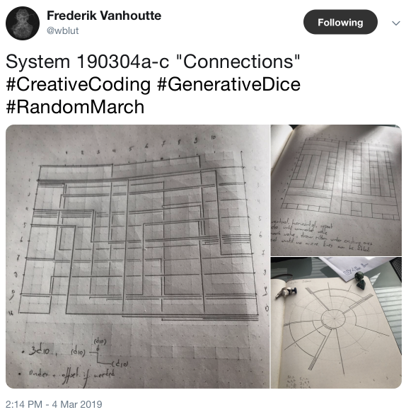
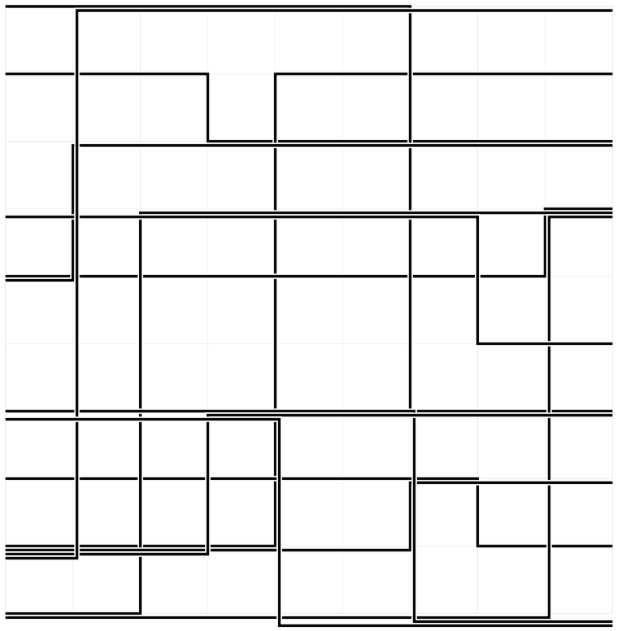

I recently came across some simple but fun [generative
drawings](https://twitter.com/wblut/status/1102557824192835584) posted by
[FrederikVanhoutte](https://www.wblut.com).



The algorithm governing their creation is quite simple:

* Create a 10x10 square grid
* Roll a 10-sided die to pick a starting location along the left-hand side of the grid (`y1`)
* Roll a 10-sided die to determine how long to draw a line toward the right-hand side of the grid (`x`)
* Role a 10-sided die to determine the ending location along the right-hand side of the grid (`y2`)
* Draw three, connected lines with these vertices: `(0, y1), (x,y1), (x,y2), (10,y2)`

There are two additional _aesthetic_ rules that govern the appearance of the lines in the drawing:

* If two line segments would overlap, offset the second until it does not overlap any prior segments
* If a line crosses another, create a gap at their intersection to keep them from touching

Frederik's postings show pen and paper drawings he created using the above rules, a straight-edge, and a
10-sided die. I wanted to see the results would look like when imagined on a computer screen.

A brief search revealed [svg.js](https://svgjs.com/docs/2.7/), a nice library for creating _scalable vector
graphics_ (SVG) directly in a browser page. The docs leverage [JSFiddle](https://jsfiddle.net) to do this, and
that is the approach I took as well. The code for my generative version is
[here](https://jsfiddle.net/bradhowes/5L6nkrta/).[^1] Press the "Run" button in the upper left-hand corner of your
browser to generate new images.



## Comments on the Code

I am not a strong Javascript programmer, but I think the code is fairly straightforward. I also think it
does a good job replicating what Frederik achieved with pen and paper. Note that I deviated slightly from above
when calculating the `x` value: instead of a 10-sided die, I roll one with 9 sides.

The code starts out with some configuration settings that affect the appearance of the generated image. Next are
two function definitions `xmur3` and `sfc32` which I shamelessly copied from a [stackoverflow
posting](https://stackoverflow.com/questions/521295/seeding-the-random-number-generator-in-javascript). These
two functions allow me to generate random values much like `Math.random` but with control of the initial _seed_
values for the random sequence. This lets me recreate any image as long as I know the original seed values. For
simplicity, I use the value from `Date()` which returns a string showing the current date and time.

After the random routine setup, I create a new SVG image and attach it to the "canvas" `div` element on the web
page. The routine `offsets` takes in three values (`y1`, `x`, `y2`) and returns non-overlapping values which
`drawFigure` uses to create the vertices of the lines it draws. To achieve the _gap_ effect mentioned above when
two lines intersect, I first draw the lines with a wide pen in white to erase any intersections, and then I draw
with a narrower pen in black for the final lines. Finally, I create new SVG image that shows the random seed
value just in case I wish to recreate the image in the future.

## Code

```javascript
// Replicate 'System 190304a-c "Connections"'' by Frederik Vanhoutte
// https://twitter.com/wblut/status/1102557824192835584

const lineCount = 14
const lineWidth = 0.04
const gap = 0.02
const lineWidthAndGap = lineWidth + gap

const gridAttr = {
  width: 0.01,
  color: '#eee'
}
const pathAttr = {
  width: lineWidth + gap * 2,
  color: "#fff"
}
const lineAttr = {
  width: lineWidth,
  color: "#000"
}

// https://stackoverflow.com/questions/521295/seeding-the-random-number-generator-in-javascript
function xmur3(str) {
  for (var i = 0, h = 1779033703 ^ str.length; i < str.length; i++)
    h = Math.imul(h ^ str.charCodeAt(i), 3432918353);
  h = h << 13 | h >>> 19;
  return function() {
    h = Math.imul(h ^ h >>> 16, 2246822507);
    h = Math.imul(h ^ h >>> 13, 3266489909);
    return (h ^= h >>> 16) >>> 0;
  }
}

// Obtain a random number generator with given initial state
function sfc32(a, b, c, d) {
  return function() {
    a >>>= 0;
    b >>>= 0;
    c >>>= 0;
    d >>>= 0;
    var t = (a + b) | 0;
    a = b ^ b >>> 9;
    b = c + (c << 3) | 0;
    c = (c << 21 | c >>> 11);
    d = d + 1 | 0;
    t = t + d | 0;
    c = c + t | 0;
    return (t >>> 0) / 4294967296;
  }
}

// Set to constant string value to recreate the same image
const randSeed = Date() // "Tue Mar 05 2019 14:03:31 GMT+0100 (CET)"
const seedGen = xmur3(randSeed)
const randGen = sfc32(seedGen(), seedGen(), seedGen(), seedGen())

var canvas = SVG().addTo('#canvas')
canvas.size('100%', '100%')
canvas.viewbox(-1, -1, 11, 11)

var xpaths = [
  [0, 0, 0, 0, 0, 0, 0, 0, 0, 0],
  [0, 0, 0, 0, 0, 0, 0, 0, 0, 0],
  [0, 0, 0, 0, 0, 0, 0, 0, 0, 0],
  [0, 0, 0, 0, 0, 0, 0, 0, 0, 0],
  [0, 0, 0, 0, 0, 0, 0, 0, 0, 0],
  [0, 0, 0, 0, 0, 0, 0, 0, 0, 0],
  [0, 0, 0, 0, 0, 0, 0, 0, 0, 0],
  [0, 0, 0, 0, 0, 0, 0, 0, 0, 0],
  [0, 0, 0, 0, 0, 0, 0, 0, 0, 0],
  [0, 0, 0, 0, 0, 0, 0, 0, 0, 0]
]

var ypaths = [
  [0, 0, 0, 0, 0, 0, 0, 0, 0, 0],
  [0, 0, 0, 0, 0, 0, 0, 0, 0, 0],
  [0, 0, 0, 0, 0, 0, 0, 0, 0, 0],
  [0, 0, 0, 0, 0, 0, 0, 0, 0, 0],
  [0, 0, 0, 0, 0, 0, 0, 0, 0, 0],
  [0, 0, 0, 0, 0, 0, 0, 0, 0, 0],
  [0, 0, 0, 0, 0, 0, 0, 0, 0, 0],
  [0, 0, 0, 0, 0, 0, 0, 0, 0, 0],
  [0, 0, 0, 0, 0, 0, 0, 0, 0, 0],
  [0, 0, 0, 0, 0, 0, 0, 0, 0, 0]
]

// Offset given values based on previous lines
function offsets(y1, x, y2) {

  // First calculate offsets
  const ry1 = ypaths[y1]
  const ry2 = ypaths[y2]
  const rx = xpaths[x]

  const yo1 = Math.max(...ry1.slice(0, x))
  const yo2 = Math.max(...ry2.slice(x, 10))
  const rxs = y2 > y1 ? rx.slice(y1, y2) : rx.slice(y2, y1)
  const xo = Math.max(...rxs)

  // Now update values for future offset calculations
  for (var i = 0; i < x; ++i) {
    ry1[i] = yo1 + lineWidthAndGap
  }
  for (i = x; i < 10; ++i) {
    ry2[i] = yo2 + lineWidthAndGap
  }

  if (y2 > y1) {
    for (i = y1; i < y2; ++i) {
      rx[i] = xo + lineWidthAndGap
    }
  } else {
    for (i = y2; i < y1; ++i) {
      rx[i] = xo + lineWidthAndGap
    }
  }

  return [y1 + yo1, x + xo, y2 + yo2]
}

// Generate random integer in range [x, y)
function rint(x, y) {
  return Math.floor(randGen() * (y - x + 1)) + x
}

// Draw faint graph paper lines
for (var i = 0; i < 10; ++i) {
  canvas.line(i, 0, i, 9).stroke(gridAttr)
  canvas.line(0, i, 9, i).stroke(gridAttr)
}

function drawFigure() {
  const y1i = rint(0, 9)
  const y2i = rint(0, 9)
  if (y2i == y1i) return drawFigure()

  const yxy = offsets(y1i, rint(1, 8), y2i)

  const y1 = yxy[0]
  const x = yxy[1]
  const y2 = yxy[2]
  const pts = [0, y1, x, y1, x, y2, 9, y2]
  canvas.polyline(pts).fill('none').stroke(pathAttr)
  canvas.polyline(pts).fill('none').stroke(lineAttr)
}

for (var j = 0; j < lineCount; ++j) {
  drawFigure()
}

canvas = SVG().addTo('#canvas')
canvas.size('100%', '100%')
canvas.text('Seed: ' + randSeed).font({
  family: 'Arial',
  size: 14
})
```
[^1]: I tried tweeting a link to my JSFiddle page, but Twitter always responded something about protecting
    others from spam, which I found rather surprising. A Google search led me to
    [this](https://github.com/jsfiddle/jsfiddle-issues/issues/1417). Sad that [Twitter](https://twitter.com)
    operates in such a heavy-handed manner to an external site.
