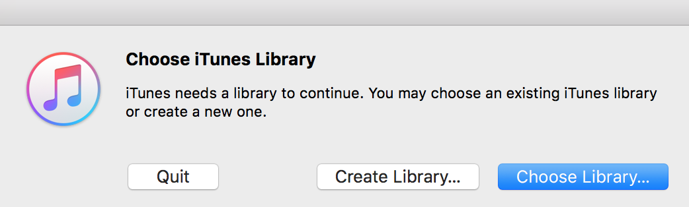
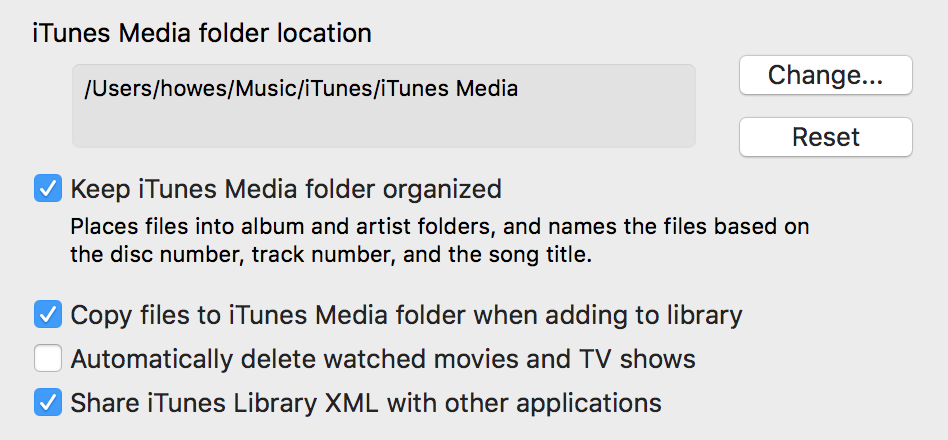

--- 
title: Apple iTunes Library Manipulation with Python
description: Short discussion on using Python to manipulate the contents of an iTunes Library XML file.
date: 2017-06-26 10:06:00+01:00
author: Brad Howes
tags: Python, XML, iTunes
layout: post.hbs
image: image.png
---

At home my family uses Apple iTunes and Safari for the majority of our media playing on our TV. This simple
setup runs on a 2010 Mac Mini that I purchased prior to us moving to Prague. It has worked very well as a
barebones media server that the children know how to use without too much support from me. Recently, I decided
to try and consolidate onto one mirrored 4TB drive the media that was on two separate drives (one internal, one
external).

To perform the consolidation, I used [rsync](https://en.wikipedia.org/wiki/Rsync) to copy from the two source
drives to the new big drive. Though normally used to manage file collections among two or more separate
machines, it offers a great collection of features for copying locally on the same machine. For instance, the
[macOS version](https://developer.apple.com/legacy/library/documentation/Darwin/Reference/ManPages/man1/rsync.1.html)
contains the smarts to also sync any metadata and extended filesystem attributes associated with the media
files. Two `rsync` commands left me with a new disc with all of the media intact and no errors.

Next, I started up iTunes while holding down the `option` key in order to bring up a prompt that allowed me to
create a new library.



I then changed some advanced iTunes settings in order to use the new media disc drive and to let iTunes manage
its contents. I also enabled the `Share iTunes Library XML with other application` setting so that I could
perform some library manipulation described next.



## Migrating Metadata

Since I created a new library above, I no longer had any metadata associated with media content such as play
counts or ratings as these are held inside a specific iTunes library file. The next step was to copy over the
metdata from the old iTunes library file. The `Share iTunes Library XML with other application` options
mentioned above asks iTunes to generate and *monitor* an XML representation of the library. Changes made by this
file will hopefully appear within iTunes, and ideally into the iTunes Cloud service so that linked mobile
devices will also see any metadata changes.

[Python](https://www.python.org) has a built-in library for reading in Apple XML files –
[plistlib](https://docs.python.org/3/library/plistlib.html). Although it seems to apply to just `plist` files
(those with a suffix of `.plist`), it properly handles the `.xml` file that iTunes creates from its library
contents. Using `plistlib` I was able to create a short script that migrated certain metadata values from the
old library to the new one.

```python
def merge(srcPath, dstPath):

    print('-- loading', srcPath)
    srcRoot = plistlib.readPlist(srcPath)

    srcMap = makeSrcMap(srcRoot)
    print('-- found', len(srcMap), 'tracks with metadata')

    print('-- loading', dstPath)
    dstRoot = plistlib.readPlist(dstPath)

    copyAttributes(dstRoot, srcMap)
    plistlib.writePlist(dstRoot, dstPath)
```

In an iTunes library each media *entity* (audio, movie, etc) is called a *track* and is given a unqiue integer.
Unfortunately, these integer values are not the same across libraries. Therefore, I had to generate my own keys
using track attributes that would not change across library instances yet would not collide with other tracks in
the library. I chose a 5-tuple made up of the following attributes:

* `Name` — track name
* `Album` — collection name where the track resides
* `Total Time` — measure of how long the media is in seconds
* `Size` — measure of how large the media is in bytes
* `Location` — location of the media file

The `Album` name protects against duplicate song names from different albums. The `Total Time` and `Size` use
physical characteristics to further protect against name collisions. Finally the last component of the
`Location` path protects against situations where there are duplicate audio files – something that should
probably be cleaned up in the future. Note that only the last component can be assumed to be shared across the
libraries; everything else in the path can be different.

```python
def makeKey(attributes):
    return (attributes.get('Name'), attributes.get('Album'), attributes.get('Total Time'),
            attributes.get('Size'), getTrackFile(attributes))

def getTrackFile(attributes):
    location = attributes.get('Location')
    if location is None: return ''
    return urlparse(location).path.split('/')[-1]
```

Now that I have (hopefully) unique keys that will apply across iTunes libraries, I next build a mapping of these
keys and track entities from the source library in order to find them with keys generated from the destination library.

```python
def makeSrcMap(srcRoot):
    srcMap = {}
    for trackId, attributes in srcRoot['Tracks'].items():
        if attributes.get('Genre') == 'Voice Memo':
            continue

        itemKey = makeKey(attributes)
        if srcMap.get(itemKey) != None:
            print('*** duplicate itemKey:', itemKey)
            pprint(srcMap[itemKey])
            pprint(attributes)
            continue

        srcMap[itemKey] = attributes
    return srcMap
```

(the check for "Voice Memo" `Genre` attribute removes collisions I had with voice memos from an iPhone — this
was the easiest way to deal with them)

Finally, I iterated over the tracks in the destination library, looking for matches in the `srcMap` dictionary I
created above.

```python
def copyAttributes(dstRoot, srcMap):
    for trackId, attributes in dstRoot['Tracks'].items():
        if attributes.get('Genre') == 'Voice Memo':
            continue

        itemKey = makeKey(attributes)
        srcItem = srcMap.get(itemKey)
        if srcItem is not None:
            changed = []
            for attributeName in ('Play Count', 'Play Date', 'Play Date UTC',
                                  'Skip Count', 'Skip Date'
                                  'Rating', 'Rating Computed',
                                  'Album Rating', 'Album Rating Computed',
                                  'Loved', 'Album Loved'):
                value = srcItem.get(attributeName)
                if value is not None:
                    attributes[attributeName] = value
                    changed.append(attributeName)
            if len(changed) > 0:
                print('-- updated', itemKey, changed)
```

Here I'm only interested in `Play Count`, `Play Date`, `Play Date UTC`, `Skip Count`, `Skip Date`, `Rating`,
`Rating Computed`, `Album Rating`, `Album Rating Computed`, `Loved` and `Album Loved` attributes. If the
attribute is one of these, I set its value in the track of the destination library. Once all of the tracks are
set, I then write out a new version of the XML file using `plistlib.writePlist` method.

## Full Script

[Here](merge.py) in full is the script that I used. To run from the command line:

```shell
% python merge.py SRC DST
```

where `SRC` is the path to the source library XML file and `DST` is the path to the destination library XML
file. Probably best to quit iTunes before running the command if iTunes is watching `SRC` or `DST` files.

```python
from __future__ import print_function
import cPickle, os, time, plistlib, sys
from pprint import pprint
from urlparse import urlparse

def getTrackFile(attributes):
    location = attributes.get('Location')
    if location is None: return ''
    return urlparse(location).path.split('/')[-1]

def makeKey(attributes):
    return (attributes.get('Name'), attributes.get('Album'), attributes.get('Total Time'),
            attributes.get('Size'), getTrackFile(attributes))

def makeSrcMap(srcRoot):
    srcMap = {}
    for trackId, attributes in srcRoot['Tracks'].items():
        if attributes.get('Genre') == 'Voice Memo':
            continue

        itemKey = makeKey(attributes)
        if srcMap.get(itemKey) != None:
            print('*** duplicate itemKey:', itemKey)
            pprint(srcMap[itemKey])
            pprint(attributes)
            continue

        srcMap[itemKey] = attributes
    return srcMap

def copyAttributes(dstRoot, srcMap):
    for trackId, attributes in dstRoot['Tracks'].items():
        if attributes.get('Genre') == 'Voice Memo':
            continue

        itemKey = makeKey(attributes)
        srcItem = srcMap.get(itemKey)
        if srcItem is not None:
            changed = []
            for attributeName in ('Play Count', 'Play Date', 'Play Date UTC',
                                  'Skip Count', 'Skip Date'
                                  'Rating', 'Rating Computed',
                                  'Album Rating', 'Album Rating Computed',
                                  'Loved', 'Album Loved'):
                value = srcItem.get(attributeName)
                if value is not None:
                    attributes[attributeName] = value
                    changed.append(attributeName)
            if len(changed) > 0:
                print('-- updated', itemKey, changed)

def merge(srcPath, dstPath):

    print('-- loading', srcPath)
    srcRoot = plistlib.readPlist(srcPath)

    srcMap = makeSrcMap(srcRoot)
    print('-- found', len(srcMap), 'tracks with metadata')

    print('-- loading', dstPath)
    dstRoot = plistlib.readPlist(dstPath)

    copyAttributes(dstRoot, srcMap)
    plistlib.writePlist(dstRoot, dstPath)

if __name__ == '__main__':
    merge(sys.argv[1], sys.argv[2])
```
