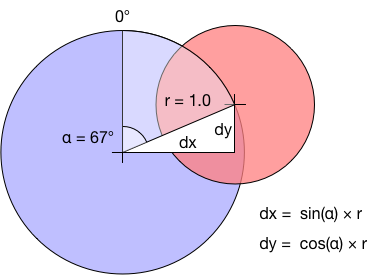

--- 
title: JoyStickView for iOS in Swift
description: Documents how I implemented a JoyStick view for a Swift iOS project
date: 2016-12-06 12:18:02+02:00
author: Brad Howes
tags: Swift, UI
layout: post.hbs
image: animation.gif
---

I've been working on implementing a version of an old arcade game in Swift. The original game uses a joystick to
move a character around on the screen, and I wanted a similar control but using touch for iOS devices. This has
been done before of course, but I have always disliked how the base of the joystick was fixed, requiring the
player to adapt to the position of the joystick. I wanted to joystick to adapt to the player's hand in order to
offer a more comfortable playing position.

## Joy of Sticks

A mechanical joystick usually reports one or two pieces of information:

* some indication of the direction the handle is pointing (angle)
* optionally, some measure of how far from the center the handle moved (displacement)

For my game, I only need the first piece of information, but I designed the JoyStickView interface to provide
both. The JoyStickView class stores these movement information in two read-only properties:

* `angle` — the orientation of the handle, in units of degrees with 0° pointing up and 90° pointing to the
right.
* `displacement` — how far from the center the handle moved, from 0.0 to 1.0 with the latter being the radius of
the joystick base.

The `JoyStickView` class also offers a `monitor` property which accepts a function which takes two arguments of
`CGFloat` type. When set, the view will call the function passing in the current angle and displacement values
when the values change from the last report. For instance, the `proc` below will print out to the console the
angle and displacement values when they change:

```swift
let view = JoyStickView(...)
let proc = { (angle CGFloat, displacement CGFloat) in print("\(angle) \(displacement)) }
view.monitor = proc
```

## Movement Calculations

The operational guts of the `JoyStickView` class resides in its `updateLocation` method. This function takes in
a `CGPoint` value which is expressed in the coordinate system of the view's *parent* — we operate in the
parent's coordinate system to make our calculations easier.

First, we make sure that view and the touch location are usable, Next we calculate a displacement value from the
deltas between the joystick center and the handle center:

```swift
guard let superview = self.superview else { return }
guard superview.bounds.contains(location) else { return }

// Calculate displacements between given location and our frame's center
//
let delta = location - frame.mid

// Calculate normalized displacement
//
let newDisplacement = delta.magnitude / radius

// Calculate pointing angle used displacements. NOTE: using this ordering of dx, dy to atan2f to obtain
// navigation angles where 0 is at top of clock dial and angle values increase in a clock-wise direction.
//
let newAngleRadians = atan2f(Float(delta.dx), Float(delta.dy))
```

> **NOTE**: the arguments to `atan2f` are swapped from the text book norm in order to obtain a north/up
> orientation for 0° with angle values increasing in a clock-wise direction.



If the view supports moving the base, we need to calculate where the base should go. First, we calculate where
on the perimeter of the base is the location of the handle image to keep the two separated by the radius of the
base. From that point, we work backwards to locate the ideal base 'center' by simply subtracting from the
original touch position the handle position and then radius of the base. Finally, if there is a `movableBounds`
setting, we constrain the result to it so that the frame of the base always resides within it.

```swift
// Calculate point that should be on the circumference of the base image.
//
let end = CGVector(dx: CGFloat(sinf(newAngleRadians)) * radius,
                   dy: CGFloat(cosf(newAngleRadians)) * radius)

// Calculate the origin of our frame, working backwards from the given location, and move to it.
//
let origin = location - end - CGSize(width: radius, height: radius)
if movableBounds != nil {
    frame.origin = CGPoint(x: min(max(origin.x, movableBounds!.minX), movableBounds!.maxX - frame.width),
                           y: min(max(origin.y, movableBounds!.minY), movableBounds!.maxY - frame.height))
}
else {
    frame.origin = origin
}
```

Finally, we set the handle position

```swift
// Update location of handle
//
handleImageView.center = bounds.mid + delta
```

The code for the *fixed* joystick base is considerably simpler. We only need to make sure that the handle's
center does not move further away from the joystick base than the radius of the base:

```swift
// Update location of handle
//
if newDisplacement > 1.0 {

    // Keep handle on the circumference of the base image
    //
    let x = CGFloat(sinf(newAngleRadians)) * radius
    let y = CGFloat(cosf(newAngleRadians)) * radius
    handleImageView.frame.origin = CGPoint(x: x + bounds.midX - handleImageView.bounds.size.width / 2.0,
                                           y: y + bounds.midY - handleImageView.bounds.size.height / 2.0)
}
else {
    handleImageView.center = bounds.mid + delta
}
```

After the graphical positioning above, we finally update the angle and displacement values and call any
installed monitor procedure. Note that we set `angle` to 0° if the handle is in the center of the base.

```swift
// Update joystick reporting values
//
let newClampedDisplacement = min(newDisplacement, 1.0)
if newClampedDisplacement != displacement || newAngleRadians != lastAngleRadians {
    displacement = newClampedDisplacement
    lastAngleRadians = newAngleRadians

    // Convert to degrees: 0° is up, 90° is right, 180° is down and 270° is left
    //
    self.angle = newClampedDisplacement != 0.0 ? CGFloat(180.0 - newAngleRadians * 180.0 / Float.pi) : 0.0
    monitor?(angle, displacement)
}
```

## Code

The source code for my `JoyStickView` class is found as part of a
[Xcode Swift playground](https://github.com/bradhowes/Joystick) on Github. See the
[README](https://github.com/bradhowes/Joystick) there for details on the playground content and the
[JoyStickView.swift](https://github.com/bradhowes/Joystick/blob/master/Joystick.playground/Sources/JoyStickView.swift)
in particular.

