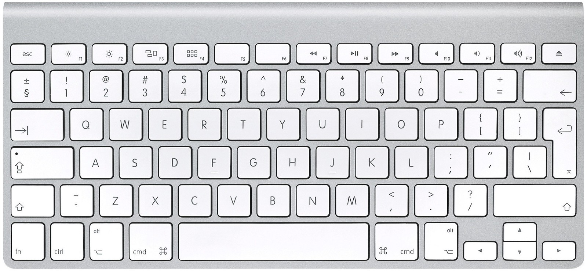

--- 
title: Remapping Keys on macOS High Sierra
description: Short discussion on how I remapped the keys on my MacBook Pro w/ an international layout.
date: 2018-04-06 10:06:00+01:00
author: Brad Howes
tags: macOS
layout: post.hbs
image: ../../images/computer-keyboard-stones-on-grass-background-header.jpg
---

When I joined Criteo, I was given a brand new MacBook Pro, the one with the Touch Bar and the less-than-stellar
keyboard. I'm still getting used to the keys, but the biggest problem was that contrary to my expressed wishes,
I received an international key layout, with keys like so:



I have never had the need to type a "§" or a "±" in my life, so that key in the upper-left corner is completely
useless to me. Worse, it occupies a place where I would normally type a "\`" or a "\~" -- characters that are
useful in my typing at work and in Markdown text like this blog entry.

I've done remapping before on macOS, in particular to make typing in Czech much easier without having to resort
to switching to a Czech keyboard layout. I used the program
[Ukelele](http://scripts.sil.org/cms/scripts/page.php?site_id=nrsi&id=ukelele) to do the necessary configury to
get the necessary diacritics for vowels that are pretty common in Czech.

However, starting with macOS 10.12 Sierra, Apple made some major changes to how key remapping takes place -- for
the better in my opinion. I can now perform major remapping of key codes instead of just tweaking _dead keys_
like I was doing with Ukelele. I am now able to restore the "`" / "~" key to its proper place, and improve my
touch typing with my left hand while using this laptop.

The utility to accomplish this is called `hidutil`. It is briefly described in an
[Apple Technical Note](https://developer.apple.com/library/content/technotes/tn2450/_index.html). I wrote a
short Bash script to help with the formatting of parameters it takes.

```bash
FROM='"HIDKeyboardModifierMappingSrc"'
TO='"HIDKeyboardModifierMappingDst"'

ARGS=""
function Map # FROM TO
{
    CMD="${CMD:+${CMD},}{${FROM}: ${1}, ${TO}: ${2}}"
}

BACKQUOTE="0x700000035"
SHIFT_LOCK="0x700000039"
SECTION="0x700000064"
L_SHIFT="0x7000000E1"
R_COMMAND="0x7000000E7"
L_CONTROL="0x7000000E0"

Map ${SECTION} ${BACKQUOTE}
Map ${SHIFT_LOCK} ${L_SHIFT}
Map ${R_COMMAND} ${SHIFT_LOCK}
Map ${BACKQUOTE} ${L_CONTROL}

hidutil property --set "{\"UserKeyMapping\":[${CMD}]}"
```

The script performs the following mapping:

* Map "§" to "\`" (and "±" to "~" when shifted)
* Make the `Caps Lock` key act like a `Shift` key
* Make the right `Command` (⌘) key act like `Caps Lock`
* Make the key between `Shift` and "Z" act like a `Control` key

The motivation for the additional mappings is to reduce the amount of mis-typed keys I while using Emacs. My
muscle memory is highly tuned to Apple's US keyboard layout, and I found myself prone to mistyping common Emacs
chord sequences when using the international version. The mapping does help, but it is not perfect. However, the
biggest source of errors -- the badly placed "\\" key -- has no solution yet, and my right hand still suffers
for it.

The `Map` function generates a mapping from one key code to another and appends it to previous mappings, all
stored in the `CMD` variable. The contents of `CMD` are then used to generate a "UserKeyMapping" value for
`hidutil` to consume.

This works great, but I need to run this every time I log in. To fix that, I created a short LaunchAgent
configuration file that will run when logging in:

```xml
<?xml version="1.0" encoding="UTF-8"?>
<!DOCTYPE plist PUBLIC "-//Apple Computer//DTD PLIST 1.0//EN" "http://www.apple.com/DTDs/PropertyList-1.0.dtd">
<plist version="1.0">
<dict>
   <key>Label</key>
   <string>com.user.loginscript</string>
   <key>ProgramArguments</key>
   <array><string>/Users/howes/bin/remap</string></array>
   <key>RunAtLoad</key>
   <true/>
</dict>
</plist>
```

I then put that configuration file in `~/Library/LaunchAgents` directory. Now, my `remap` script runs every time
I log in.
