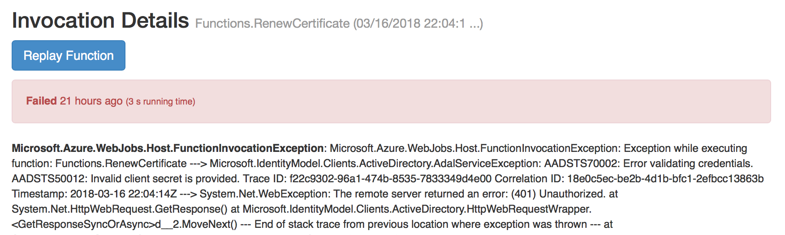
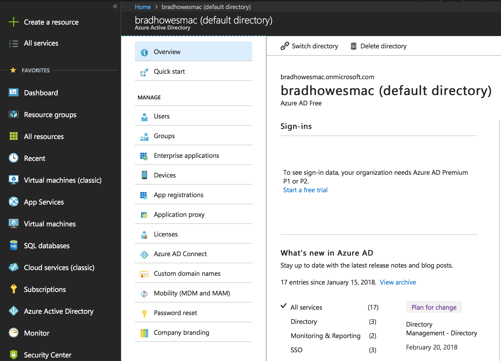
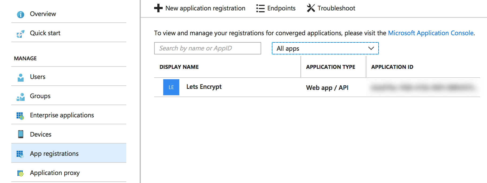
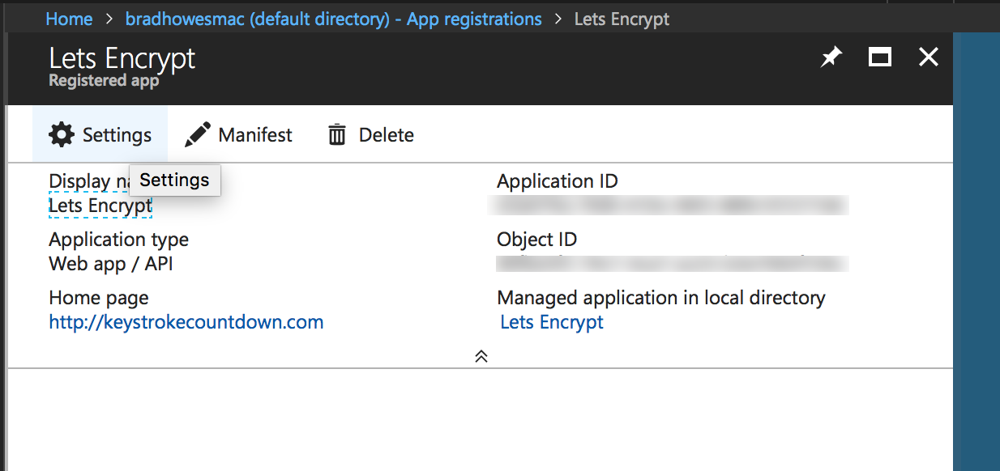
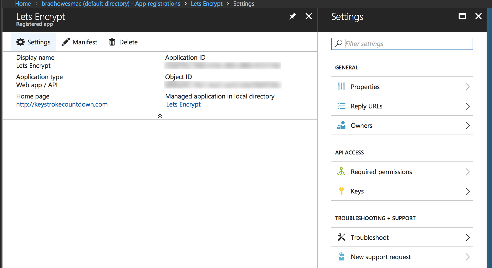
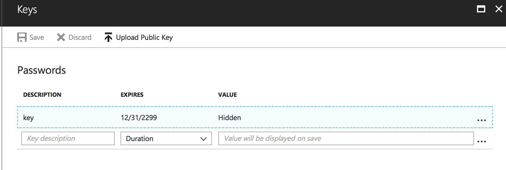
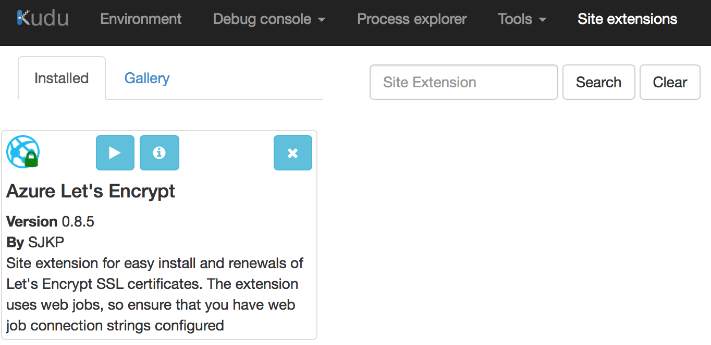
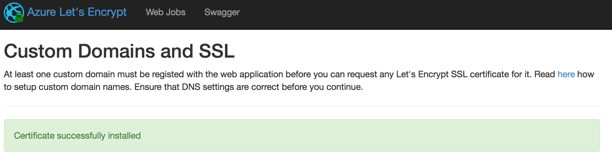

--- 
title: Fixing Azure Let's Encrypt Expired Key
description: Account of what I did to fix a broken Azure Let's Encrypt web job
date: 2018-03-17 12:18:02+01:00
author: Brad Howes
tags: Azure, Lets Encrypt
layout: post.hbs
image: computer-keyboard-stones-on-grass-background-header.jpg
---

For the past year, this blog site has supported SSL connections using a certificate provided by the free
[Let's Encrypt](https://letsencrypt.org) service. I use the
[Let's Encrypt Site Extension](https://github.com/sjkp/letsencrypt-siteextension) created by Simon J.K. Pedersen
to do the certificate renewal. It was a bit of a pain to set up, but it has been running flawlessly for a year.
Until now.

Every 3 months, I get an email from Let's Encrypt notifying me that the certificate I am using from them is
about to expire. I create a calendar entry a couple of days prior to the expiration date to check that the renew
took place. I was rather suprised when this day arrived and I find that there were errors trying to renew the
certificate.

Looking at the error message and stack trace was not too informative, though the words "Invalid client secret"
seemed like a good place to start. Google search showed me that it was due to an expired key that the Let's
Encrypt web job held to allow it to access my site's configuration. Now, I just needed to figure out how to fix
this. More Google searching and poking around on the Azure portal finally got things working again. Here are the
steps I took to make it so.

First, I clicked on _Azure Active Directory_ in the portal:

Next, I brought up the _App registrations_ blade:

Note that for me I had to select *All apps* before I saw anything. Clicking on the _Lets Encrypt_ entry brought
up a new panel with general info:

Clicking on _Settings_ brings up a new panel with what we are after: _Keys_

The _Keys_ panel reveals the source of the problem I was having. When I first installed the Azure Lets Encrypt
web job, the maximum expiration time for a key was 1 year. Now, I can create a new one with an _infinite_
expiration time.

Note that the interface for this pane is a _pain_ to understand. Basically, to create a new key enter something
in the _Key description_ field, set the desired _Duration_ value, and click on _Save_. Azure will generate a new
value for the key and show it in the VALUE column. *Be sure to copy it!* -- the key will disappear once you
dismiss the panel.

Now we need to update the new key value. The first place is in the app's _Application Settings_ panel. The new
value should appear in `_letsencrypt:ClientSecret` setting. Be sure to save the update before leaving the panel.

Next, we need to change the key value used by Azure Let's Encrypt extension. Go to the Kudu site for your Azure
web app (eg https://blahblahblah.scm.azurewebsites.net). From there, click on _Site extensions_. I only have
one, so I get this:

Click on the _play_ button to show the configuration screen for the site extension. Paste in the new key value
in the _ClientSecret_ field, then click on _Next_. If all goes well, you will get to the "Request and Install
Certificate" screen. Select the hostname to update and then click on "Request and Install certificate" button.
Hopefully, this is the result:

