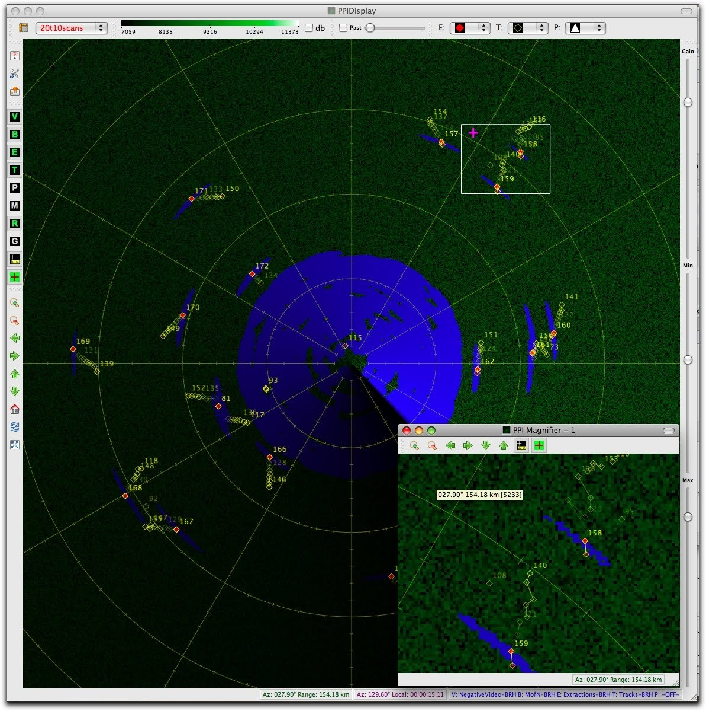

This is a screen capture of a radar display I wrote using [Qt](http://www.qt.io) and OpenGL. The display runs in
real-time at a rate of about +60 fps as the radar rotates at 10 RPM. Each radar return contains about 4K samples
16-bit, and I draw all of them (no decimation) via OpenGL calls. The display supports multiple views, panning,
zooming, etc. as well as multiple input channels. Each input channel writes to an off-screen frame buffer, and an
update of the screen is a simple compositing of the textures associated with the off-screen frame buffers and
additional graphical data such as range/azimuth markings, extraction and track plots.

I created the simulated phosphor effect using a disc texture with an alpha contour that fades the older pixels
as the disc rotates along with the radar. There is also some slight bloom effect for very high-intensity
returns.

[Here is a short video](https://www.youtube.com/watch?v=jNFCw44MPn0&t=6s) that highlights some of the features of the
PPI display, especially the compositing of various features in OpenGL for fast rendering.
