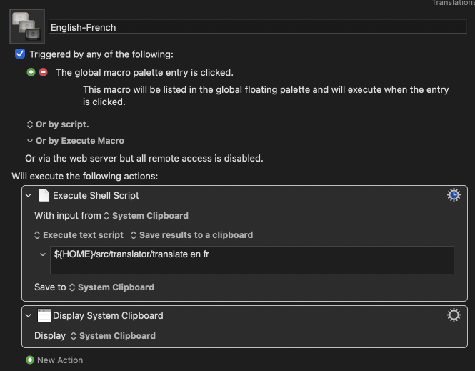
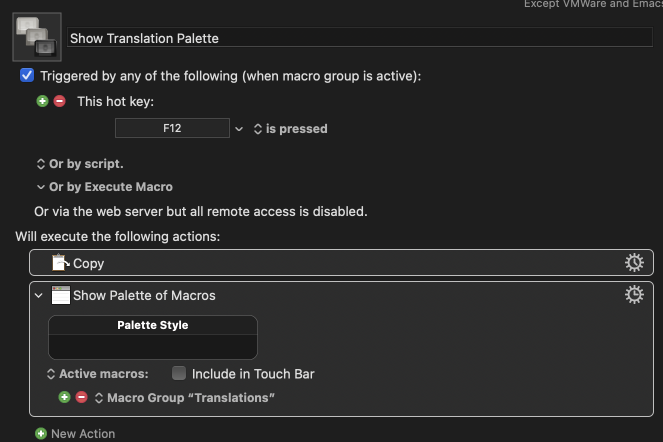
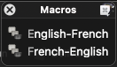
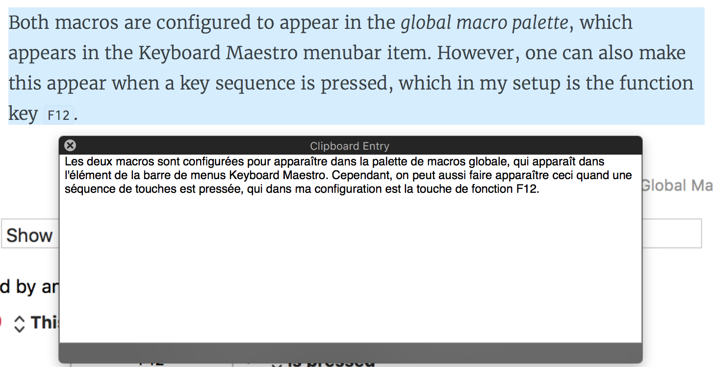

--- 
title: Text Language Translation Utility
description: Brief discussion of Node.js utility I use on macOS to translate text between French and English
date: 2018-08-13 12:18:02+01:00
author: Brad Howes
tags: Google, Keyboard Maestro, Node.js
layout: post.hbs
image: translate.png
---

Ever since moving to Europe back in 2010, I have been a dedicated user of
[Google Translate](https://translate.google.com). However, cutting-and-pasting between a web site or text
document and the Translate's input field is a bit tedious, so I looked into ways to make it easier to integrate
into my daily life on a laptop. The solution I came up with relies on [Python](https://python.org), the
[Google translate API](https://docs.cloud.google.com/translate/docs/reference/api-overview), and the excellent macOS
utility called [Keyboard Maestro](https://www.keyboardmaestro.com/main/).

# Getting Started with Translations

There is some initial setup necessary before Google translate API can be used. I followed the instructions for the
[Python client library](https://docs.cloud.google.com/translate/docs/reference/libraries/v2/python). Next, I created a
Python virtual environment in which to install the Google Python package. A short bit later, I was able to run a simple
Python program that does the job:

```python
import sys
from google.cloud import translate_v2 as translate

def translate_text(text: str, source: str, target: str) -> str:
    result = translate.Client().translate(values=text, target_language=target, source_language=source)
    return result['translatedText']

if __name__ == '__main__':
    print(translate_text(sys.stdin.read().strip(), sys.argv[1], sys.argv[2]))
    sys.exit(0)
```

Nothing fancy -- just read in some text to translate and direct Google Translate to do the hard work. When we get the
response from Google, send the output text to stdout for another process to read. We can quickly check that it works:

```console
% echo 'The king is dead. Long live the king' | python translate.py en fr
Le roi est mort. Longue vie au roi.
```

Seems ok. Let's try the reverse for fun:

```console
% echo 'Le roi est mort. Longue vie au roi.' | python translate.py fr en
The king is dead. Long live the king.
```

# Bring in the Keyboard Maestro

Next step is to hook the `translate.py` utility to run when I press a specific key sequence after selecting some
text. First, I created two Keyboard Maestro macros for the two translation paths: English to French, and French
to English.



The only difference is the order of the `en` and `fr` arguments given to `translate.py`.


The macros read whatever text is in the __System Clipboard__ and passes it to the `translate.py` script being run in a
Python process. Keyboard Maestro reads the output of the Python process and puts it into the __System Clipboard__,
replacing the text that was there with its translation.

Both macros are configured to appear in the _global macro palette_. The global macro palette will appear when a key
sequence is pressed, which in my setup is the function key `F12`.



Now, pressing `F12` brings up a small palette with two choices:



Pressing the letter `E` will bring about the English-French translation, while pressing `F` will translate French to
English. Simple. Here is what the translation output looks like:


