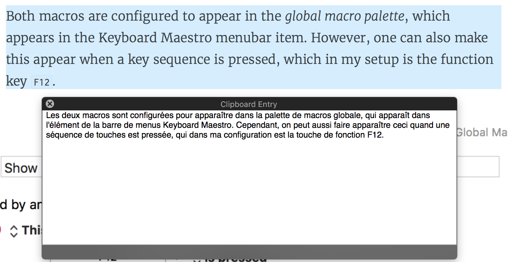

--- 
title: Text Language Translation Utility
description: Brief discussion of Nodejs utility I use on macOS to translate text between French and English
date: 2018-08-13 12:18:02+01:00
author: Brad Howes
tags: Google, Keyboard Maestro, Nodejs
layout: post.hbs
image: translate.png
---

Ever since moving to Europe back in 2010, I have been a dedicated user of
[Google Translate](https://translate.google.com). However, cutting-and-pasting between a web site or text
document and the Translate's input field is a bit tedious, so I looked into ways to make it easier to integrate
into my daily life on a laptop. The solution I came up with relies on [Nodejs](https://nodejs.org), the NPM
package [google-translate-api](https://www.npmjs.com/package/google-translate-api), and the excellent macOS
utility called [Keyboard Maestro](https://www.keyboardmaestro.com/main/).

# Getting Started with Translations

A quick search for libraries/packages that integrates with Google Translate led me to the
[google-translate-api](https://www.npmjs.com/package/google-translate-api). A short bit later, I had a simple
Nodejs program that does the job:

```javascript
const fs = require('fs');
const process = require('process');
const translate = require('google-translate-api');

// Read stdin, translate it, write to /dev/stdout
//
const sourceLanguage = process.argv[2];
const targetLanguage = process.argv[3];
const text = fs.readFileSync('/dev/stdin').toString();

translate(text, {from: sourceLanguage, to: targetLanguage}).then(res => {
    console.log(res.text);
}).catch(err => {
    console.error(err);
});
```

Nothing fancy -- just read in some text to translate and direct Google Translate to do the hard work. When we
get the response from Google, send the output text to stdout for another process to read. We can quickly check
that it works:

```console
% echo 'The king is dead. Long live the king' | node translate.js en fr
Le roi est mort. Longue vie au roi.
```

Seems ok. Let's try the reverse for fun:

```console
% echo 'Le roi est mort. Longue vie au roi.' | node translate.js fr en
The king is dead. Long live the king.
```

# Bring in the Keyboard Maestro

Next step is to hook the `translate.js` utility to run when I press a specific key sequence after selecting some
text. First, I created two macros for the two translation paths: English to French, and French to English.


The only difference is the order of the `en` and `fr` arguments given to `translate.js`.


The macros read whatever text is in the __System Clipboard__ and passes it to the `translate.js` script being
run in a Nodejs process. Keyboard Maestro reads the output of the Nodejs process and puts it into the __System
Clipboard__, replacing the text that was there with its translation.

Both macros are configured to appear in the _global macro palette_, which appears in the Keyboard Maestro
menubar item. However, one can also make this appear when a key sequence is pressed, which in my setup is the
function key `F12`.


Now, pressing `F12` brings up a small palette with two choices:


Pressing the letter `E` will bring about the English-French translation, while pressing `F` will translate
French to English. Simple. Here is what the translation output looks like:



# Postscript

After writing this up, I wondered if there was perhaps a macOS Services menu item which would do much the same
as what I did above. I found on Github [workflow-translate](https://github.com/dbmrq/workflow-translate) which
appears to do something similar (I have not tested it). The bottom of the README there points to a Medium
article called
[Fast translation with Google Translator and MAC OSX](https://medium.com/@mrdoro/fast-translation-with-google-translator-and-mac-osx-817e32233b7a)
which describes how to get Automator to do the translating work. However, it looks like the translated results
appears in a Safari window. I prefer the minimal interface provided by Keyboard Maestro.

