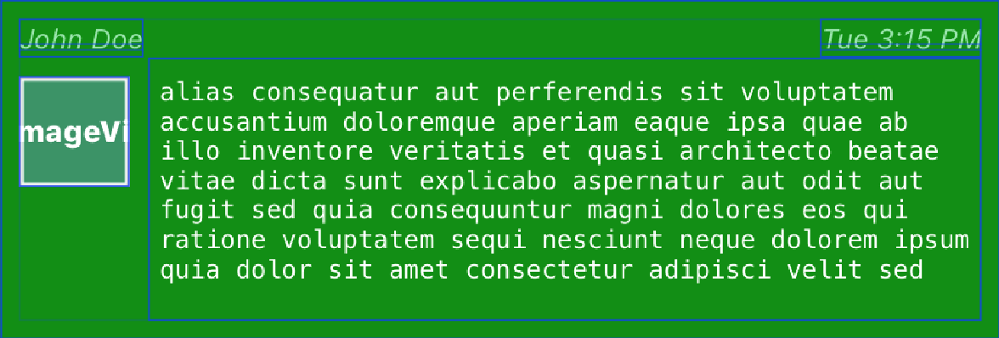
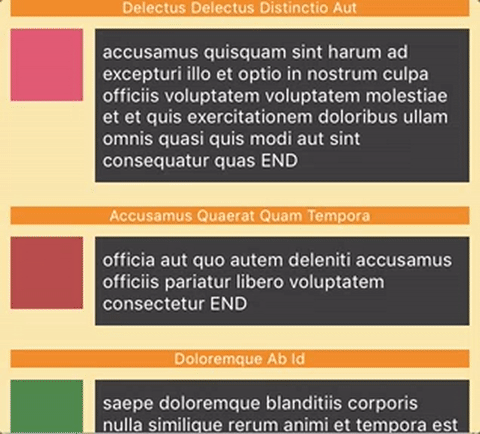

--- 
title: Variable Height UITableView Cells in Swift
description: Documents code necessary to achieve fast variable-height cells that use Auto Layout
date: 2017-01-07 12:18:02+01:00
author: Brad Howes
tags: Swift, UI
layout: post.hbs
image: animation.gif
---

Recently, I have been working on a chat view in Swift for a project that uses a
[Mattermost](http://mattermost.org) for a backend. Each entry in the chat view contains a
[`UITextView`](https://developer.apple.com/reference/uikit/uitextview)
which is probably overkill but I wanted to use its built-in data detection features and link presentations. I
designed up a cell in Xcode that looked something like this.



The central view filled with nonsense words of Latin is a `UITextView`. My desire was to make the width of this
view vary in size depending on the content.

Normally, a `UITextView` offers a scrollbar when it contains content that is larger than the view's frame. I
definitely did not want this behavior, so the first step was to disable the scrollbar for the `UITextView`.


Trying this out, I did indeed not have a scrollable view, but I also did not have a view that grew to show its
entire content. I next went to Google to find a variety of opinions on how to make this work, but nothing I did
seemed to work. Rather, I spent an embarrassing amount of time playing with Auto Layout settings and constraints
with little or no success. I would see something promising only to hit a road-block.

Finally, I decided to punt and rely on a feature of `UITableView` that allowed one to offer an *estimate* of
cell height. This indeed seemed to work, but at times there was a race between the gradual adjustment of the
scroll view with real cell heights and changes in the frame of the `UITableView` – for instance, when a keyboard
appears – which made for a suboptimal experience.

## Take Two

After solving other issues with the chat view, I decided to try once again to solve the variable height issue.
Starting from a new, clean project, I methodically began to create a set of classes that might solve the
problem. First, I went back to Apple's documentation for `UITextView` and its ancestor `UIView`, and I was
reminded of the concept of *intrinsic size*, a property some view's can adopt when they have some knowledge
about what they are displaying. Since a `UITextView` is adapted from `UIScrollView` it does not really have such
a size property — it instead relies on its ability to show content in a scrollable view, the size of which is
set by other means, such as by Auto Layout constraints. However, there is nothing to prevent the `UITextView` to
adopt an *intrinsic size* using its text content and an available width, say something derived from the fixed
width of the table in which the cell resides.

I create a new derivation of `UITextView` called `FullTextView`, and there I managed the read-only property
`intrinsicContentSize` by providing my own, calculated size called `fittedSize`.

```swift
/// Holds any calculated fitted size (see updateFittedSize() below).
var fittedSize: CGSize? = nil

/// Override intrinsicContentSize to return calculated fittedSize if it exists
override public var intrinsicContentSize: CGSize {
    get {
        return self.fittedSize ?? super.intrinsicContentSize
    }
}
```

To calculate `fittedSize` I use the `UITextView`'s own
[`NSLayoutManager`](https://developer.apple.com/reference/uikit/nslayoutmanager) to generate one for me.

```swift
private func updateFittedSize() {

    // Key!
    //
    let usedRect = layoutManager.usedRect(for: textContainer)
    fittedSize = CGSize(width: (usedRect.size.width + textContainerInset.left + textContainerInset.right),
                        height: (usedRect.size.height + textContainerInset.top + textContainerInset.bottom))
    invalidateIntrinsicContentSize()
}
```

From my initial tests, the value returned from `updateFittedSize` matched those from properly laid out
`UITextView` views. Cool!

For content updates, I hooked into two `UITextView` properties to know when they changed so that I would know
when `fittedSize` needed an updated value.

```swift
override public var attributedText: NSAttributedString! {
    didSet {
        updateFittedSize()
    }
}

override public var text: String! {
    didSet {
        updateFittedSize()
    }
}
```

Next, I needed a `UITableViewCell` that would properly size itself when a `UITextView` it held had a new size or
when the table the cell belonged to changed width – say due to an device orientation change. Here, the key was
to trigger the proper layout calculations so that when finally displayed in the table, the view would be
correct. There are two times where these calculations need to be accurately performed:

1. When the width of the cell changes
2. When one or more of the views that make up the cell change

At these times, we must ask the cell to redo the layout so that the presentation and height values will be
correct. To do that we must call `layoutIfNeeded` to trigger a new layout.

```swift
public func setup(content: Content) -> Cell {
    self.heading.text = content.title
    self.content.text = content.text
    self.avatar.image = content.image
    contentView.layoutIfNeeded()
    return self
}

/// Calculate and return the height of this cell using whatever content is currently in the views.
public var cellHeightForContent: CGFloat {
    contentView.layoutIfNeeded()
    return contentView.systemLayoutSizeFitting(UILayoutFittingCompressedSize).height
}

/// The current cell width. Adjust to recalculate cell heights.
public var cellWidth: CGFloat = 0.0 {
    didSet {
        contentView.frame = CGRect(x: 0.0, y: 0.0, width: cellWidth, height: 9999.0)
        contentView.layoutIfNeeded()
    }
}
```

## Height Calculation Strategies

My original searching for a solution revealed several ways to convey height information to a `UITableView`, both
exact and estimated. I decided to try and encapsulate height calculation in such a way that I could just switch
between different calculating strategies to see which one would be more performant. Thus a Swift protocol was
born.

```swift
public protocol HeightCalculationStrategy {
    var cellWidth: CGFloat {get set}

    /**
     Obtain the height of a cell when it holds a given sent of content
     - parameter content: data to put into the cell
     - parameter indexPath: the index of the cell being measured
     - returns: calculated height of the cell as it would appear in the table
     */
    func getHeight(for content: Content, at indexPath: IndexPath) -> CGFloat
}
```

I then created two strategies, one that would keep a height cache and only ever return correct values, and
another that would again set the `estimatedHeight` attribute for a `UITableView` but also provide accurate
height information when asked.

Both approaches relied on a privately-held instance of the `Cell` class I created from `UITableViewCell`
(described above). A common base class fetches one for us like so:

```swift
self.sizer = UINib(nibName: cellIdent, bundle: nil).instantiate(withOwner: nil, options: nil)[0] as! Cell
```

For the cached height strategy, I simply calculated all necessary heights in one shot like so:

```swift
if heights.count == 0 {
    heights = dataSource.map { (sizer.setup(content: $0).cellHeightForContent + verticalSpacing).rounded() }
}
return heights[indexPath.row]
```

The `EstimatedHeightCalculationStrategy` did the same, only for just one cell at a time:

```swift
return (sizer.setup(content: content).cellHeightForContent + verticalSpacing).rounded()
```

> Note that the requirement for `content` is a major sore spot in this protocol design since only one of the
> strategies uses it.

## Putting it Together

A final class, `VariableHeightTableController` brings everything together in marvelous fashion. It its
`viewDidLoad` method, we give the table a source of data to use for cell content, and we establish that the
`Cell` class will visually represent the rows of the table. Finally, we create and install a height calculation
strategy.

```swift
self.cellIdent = "Cell"
self.dataSource = DataSource(cellIdent: cellIdent, count: 1000)
tableView.dataSource = dataSource
tableView.register(UINib(nibName: cellIdent, bundle: nil), forCellReuseIdentifier: cellIdent)
heightCalculationStrategy = makeStrategy(useFast: true)
```

When the view appears or when the view's size changes, we must convey the size change to our height calculation
strategy instance so that future calls to its `getHeight` will return correct values:

```swift
override func viewWillAppear(_ animated: Bool) {
    heightCalculationStrategy.cellWidth = view.frame.width
    super.viewWillAppear(animated)
}

override func viewWillTransition(to size: CGSize, with coordinator: UIViewControllerTransitionCoordinator) {
    super.viewWillTransition(to: size, with: coordinator)
    coordinator.animate(alongsideTransition: { _ in }) { _ in
        self.heightCalculationStrategy.cellWidth = size.width
    }
}
```

Finally, we convey calculated height information to the table view:

```swift
override func tableView(_ tableView: UITableView, heightForRowAt indexPath: IndexPath) -> CGFloat {
    return heightCalculationStrategy.getHeight(for: self.dataSource[indexPath.row], at: indexPath)
}
```

## Result



## Source

The source is [freely available on Github](https://github.com/bradhowes/vhtc).
